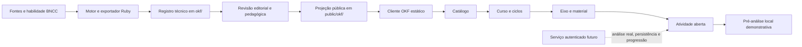

# Cognoscere · Lumira

Plataforma educacional demonstrativa organizada por competências, percursos de aprendizagem, comunidade e desafios escolares.

A **Lumira** é a camada web do Cognoscere. A aplicação publicada atualmente é uma SPA estática construída com Vite e hospedada no GitHub Pages. O curso demonstrativo consome uma projeção pública do **Open Knowledge Format — OKF v0.1**, mantendo fontes, habilidade BNCC, material, atividade e proveniência conectados.

> **Estado atual:** protótipo público para validação de produto, UX e contratos pedagógicos. Não é um ambiente de produção com autenticação, persistência de respostas ou avaliação automática oficial.

## Acessos rápidos

- [Abrir a página inicial da Lumira](https://glaucodeveloper.github.io/cognoscere/)
- [Abrir diretamente o eixo “Opinião, crítica e respeito”](https://glaucodeveloper.github.io/cognoscere/#/cursos/leitura-critica-em-rede/eixos/opiniao-critica-e-respeito)
- [Consultar a definição da plataforma](PLATAFORMA.md)
- [Consultar a documentação técnica do OKF](docs/okf/README.md)
- [Consultar a revisão de UX, páginas e fluxos](docs/stakeholders/REVISAO-UX-E-FLUXOS.md)

## Como usar a demonstração

### 1. Conhecer a proposta pública

Abra a [página inicial](https://glaucodeveloper.github.io/cognoscere/). A landing apresenta:

- progressão por competências;
- comunidade e reputação social;
- cursos ligados às áreas da BNCC;
- competições escolares;
- planos demonstrativos;
- entrada para matrícula e acesso à plataforma.

Para explorar o protótipo sem cadastro real, use **Conhecer a plataforma**. Os botões e formulários da demonstração alteram apenas o estado local da página.

### 2. Navegar pelo campus

A área interna disponibiliza as seguintes seções:

| Seção | Finalidade na demonstração |
| --- | --- |
| **Início** | Retomar o percurso, visualizar competências, quiz do dia e atividade da comunidade |
| **Áreas** | Explorar áreas do conhecimento e seus percursos |
| **Cursos** | Abrir o catálogo alimentado pelo manifesto público OKF |
| **Quizzes** | Demonstrar questões e retorno de nivelamento |
| **Fórum** | Visualizar posts, comentários, votos e reputação social |
| **Competições** | Acompanhar desafio, prazo, entrega e leaderboard escolar |
| **Escola** | Representar o espaço institucional da escola |
| **Perfil** | Separar competências, reputação, conquistas e portfólio |
| **Configurações** | Demonstrar conta, privacidade, assinatura e pagamento simulado |

No desktop, o conteúdo utiliza a largura disponível e o **Círculo** aparece como painel social recolhível. No mobile, a navegação principal fica na parte inferior e o painel social funciona como uma gaveta sobre a página.

### 3. Abrir o curso “Leitura crítica em rede”

O percurso pode ser iniciado de duas formas:

1. abrir **Cursos** e selecionar **Leitura crítica em rede**; ou
2. usar o [link direto do eixo](https://glaucodeveloper.github.io/cognoscere/#/cursos/leitura-critica-em-rede/eixos/opiniao-critica-e-respeito).

A visão geral do curso apresenta:

- título, etapa e série;
- progresso demonstrativo;
- ciclos e eixos disponíveis;
- habilidade curricular relacionada;
- fonte e estado editorial do conteúdo;
- referências públicas de proveniência;
- separação entre conteúdo exibido e inteligência interna protegida.

### 4. Estudar o eixo “Opinião, crítica e respeito”

O eixo atual pertence ao ciclo **Argumentação e evidência** e foi organizado para estudantes do **6º ano do Ensino Fundamental**.

| Campo | Conteúdo |
| --- | --- |
| Curso | Leitura crítica em rede |
| Área | Linguagens |
| Habilidade | EF69LP01 |
| Eixo | Opinião, crítica e respeito |
| Duração indicada | 18 minutos |
| Material | Praça Central: Entre a Ordem e o Direito de Viver |
| Atividade | Quando a crítica se transforma em ataque? |

Durante a leitura:

1. leia o texto sobre o debate em torno da retirada de vendedores ambulantes da praça central;
2. observe quando a discussão deixa de criticar uma decisão pública e passa a desqualificar pessoas;
3. compare o alvo, a linguagem e as consequências das falas;
4. consulte as **Lentes de leitura**, a habilidade BNCC e a proveniência exibidas na lateral;
5. avance até a atividade aberta ao final da página.

### 5. Responder à atividade aberta

A atividade solicita uma resposta de um a dois parágrafos sobre o momento em que a discussão se transforma em ataque a um grupo.

A resposta deve:

- usar pistas explícitas do texto;
- diferenciar crítica a uma decisão de ataque a pessoas;
- explicar por que determinadas palavras generalizam ou inferiorizam o grupo;
- indicar um encaminhamento responsável que não amplie a agressão.

A interface exige pelo menos **40 caracteres** para executar a demonstração. O comando pedagógico recomenda usar **ao menos duas pistas do texto**.

Depois de escrever, selecione **Pré-analisar evidências**.

## O que significa a pré-análise

A pré-análise publicada no GitHub Pages é uma **heurística local do navegador**. Ela procura marcas textuais relacionadas às evidências públicas do material e devolve uma orientação inicial.

Ela não:

- envia a resposta para um modelo de linguagem;
- persiste a resposta do estudante;
- realiza avaliação pedagógica completa;
- altera uma competência real;
- substitui revisão de professor ou responsável pedagógico.

A demonstração pública termina nesse ponto. Análise real, confirmação humana, registro de evidência e progressão dependem de um serviço autenticado futuro.

## Princípios representados no produto

### Competência, reputação e competição são domínios distintos

A plataforma não trata todas as métricas como pontos intercambiáveis:

- **competência** muda a partir de quizzes e evidências pedagógicas;
- **reputação** representa contribuições sociais em comunidades;
- **leaderboard** representa o desempenho dentro de uma competição específica.

Votos sociais e placares não devem alterar diretamente o nível de competência.

### Conteúdo público é uma projeção mínima

O navegador recebe apenas artefatos aprovados para exibição. A projeção pública não deve incluir:

- resposta de referência;
- rubrica privada;
- compreensão interna detalhada;
- prompt administrativo;
- dados identificáveis de estudantes;
- credenciais ou chaves de API;
- raciocínio interno de modelo.

### Fonte e proveniência permanecem visíveis

O curso conecta o material à habilidade **EF69LP01**, aos artefatos versionados e aos remanescentes usados na reconstrução do OKF. A interface não usa conteúdo curricular hardcoded como fallback silencioso quando o manifesto falha: o estado de erro é exibido e oferece nova tentativa.

## Limites do protótipo público

A versão hospedada deve ser entendida como demonstração funcional de interface e contratos.

| Capacidade | Estado atual |
| --- | --- |
| Navegação por hash no GitHub Pages | Implementada |
| Página pública e campus responsivo | Implementados |
| Catálogo, curso, eixo e material via `public/okf/` | Implementados |
| Atividade aberta e pré-análise local | Implementadas para demonstração |
| Exportação dos prompts Ruby para `okf/` | Implementada |
| Validação estrutural do bundle OKF | Implementada |
| Autenticação e autorização reais | Não implementadas no site estático |
| Persistência de estudante, respostas e evidências | Não implementada |
| Análise protegida por modelo e revisão docente integrada | Futura |
| Moderação social, denúncia, bloqueio e rate limit | Contratos de MVP; backend futuro |
| Assinatura e pagamento | Simulados |

O material público atual está marcado como **`legacy-needs-review`**. Ele demonstra a ligação entre conteúdo, atividade e proveniência, mas ainda exige revisão pedagógica, editorial e de adequação etária antes de uso produtivo.

## Executar localmente

### Requisitos

- Node.js 22 ou versão compatível com Vite 7;
- npm;
- JRuby apenas para exportar novamente os prompts técnicos e executar a validação completa.

### Instalação

```bash
npm ci
```

### Servidor de desenvolvimento

```bash
npm run dev
```

### Build de produção

```bash
npm run build
```

### Visualizar o build

```bash
npm run preview
```

### Validar frontend e OKF

```bash
npm run check
```

O comando `check`:

1. executa `scripts/export_ruby_prompt_okf.rb` com JRuby;
2. valida `public/okf/`;
3. valida `okf/`;
4. gera o build Vite.

Para validar apenas os bundles já existentes:

```bash
npm run validate:okf
```

## Estrutura principal

```text
cognoscere/
├── index.html
├── src/
│   ├── main.js                 # rotas, páginas e interações da SPA
│   ├── okf-client.js           # leitura segura do manifesto e dos artefatos públicos
│   └── style.css               # layout responsivo e componentes
├── public/okf/                 # projeção JSON pública consumida pelo navegador
├── okf/                        # registro técnico exportado do motor Ruby
├── docs/okf/                   # arquitetura, contratos, segurança e migração
├── docs/stakeholders/          # revisão de UX, fluxos e capturas
├── habilidades/                # recortes e compreensões pedagógicas por habilidade
├── data/                       # índices e fixtures pedagógicas
├── scripts/                    # exportação e validação
├── inicio.rb                   # motor Ruby/JRuby remanescente
├── PLATAFORMA.md               # definição funcional da Lumira
└── package.json
```

## Fluxo do conhecimento no curso



## Documentação

### Produto e experiência

- [Definição funcional da Lumira](PLATAFORMA.md)
- [Revisão de UX, páginas e fluxos](docs/stakeholders/REVISAO-UX-E-FLUXOS.md)
- [Especialização de design para cursos OKF](design-system/lumira/pages/course-okf.md)

### Open Knowledge Format

- [Visão geral do OKF no Cognoscere](docs/okf/README.md)
- [01 — Arquitetura e linhagem histórica](docs/okf/01-arquitetura-e-linhagem.md)
- [02 — Fontes e retrieval vectorless](docs/okf/02-fontes-e-retrieval-vectorless.md)
- [03 — Compreensões e instruções](docs/okf/03-compreensoes-e-instrucoes.md)
- [04 — Geração de conteúdo pedagógico](docs/okf/04-geracao-de-conteudo.md)
- [05 — Análise de resposta](docs/okf/05-analise-de-resposta.md)
- [06 — Auditoria, reescrita e reparo JSON](docs/okf/06-auditoria-reescrita-e-reparo.md)
- [07 — Projeções e visibilidade](docs/okf/07-projecoes-e-visibilidade.md)
- [08 — Integração com cursos e APIs futuras](docs/okf/08-integracao-com-cursos-e-apis.md)
- [09 — Segurança, privacidade e governança](docs/okf/09-seguranca-privacidade-e-governanca.md)
- [10 — Versionamento, testes e migração](docs/okf/10-versionamento-testes-e-migracao.md)

### Capturas de referência

- [Catálogo de cursos conectado ao OKF](output/playwright/cognoscere-okf/13-okf-course-catalog.png)
- [Visão geral do curso e proveniência](output/playwright/cognoscere-okf/14-okf-course-overview.png)
- [Material, BNCC e camadas de inteligência](output/playwright/cognoscere-okf/15-okf-course-material.png)
- [Resposta aberta e pré-análise](output/playwright/cognoscere-okf/16-okf-open-response-analysis.png)
- [Curso responsivo em mobile](output/playwright/cognoscere-okf/17-okf-course-mobile.png)
- [Catálogo publicado no GitHub Pages](output/playwright/cognoscere-okf/19-live-course-catalog.png)

## Status do repositório

O Cognoscere reúne três gerações relacionadas:

1. um pipeline TypeScript histórico para fontes, retrieval, módulos e sessões;
2. um motor Ruby/JRuby para habilidade, geração, aplicação, progressão e auditoria;
3. a SPA Lumira atual, que consome uma projeção pública estática e rastreável.

O OKF v0.1 presente no repositório é uma **reconstrução verificável e uma nova padronização** baseada nos remanescentes versionados. Ele não deve ser apresentado como cópia literal de uma base local antiga que não entrou no histórico Git.

