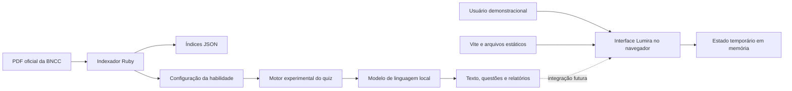
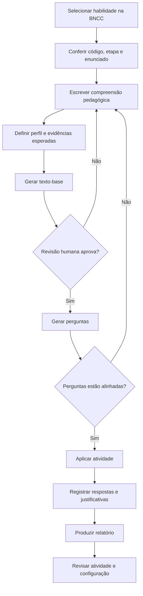
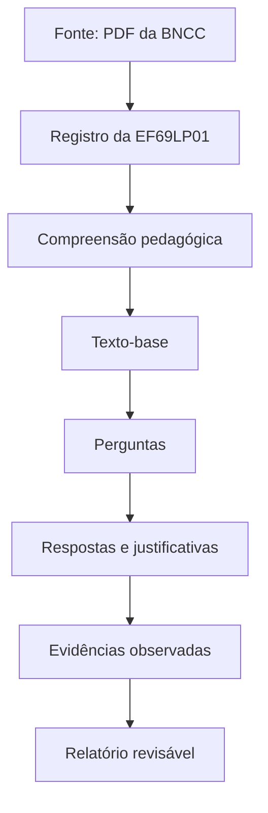

# Guia do trabalho de Computação sobre a BNCC

## 1. Identificação

| Campo | Preenchimento |
| --- | --- |
| Título sugerido | **Cognoscere/Lumira: protótipo computacional para atividades diagnósticas rastreáveis à BNCC** |
| Instituição | `[nome da instituição]` |
| Curso e disciplina | `[curso] — [disciplina]` |
| Autor(es) | `[nome(s)]` |
| Professor/orientador | `[nome]` |
| Local e ano | `[cidade] — 2026` |
| Público-alvo do protótipo | estudantes do 6º ano, professores e escolas |
| Recorte curricular | Língua Portuguesa, EF69LP01, 6º ao 9º ano |

Este documento orienta a realização do trabalho acadêmico e a reprodução do protótipo. Os campos entre colchetes devem ser adaptados às regras da instituição.

## 2. Resumo do projeto

O Cognoscere é um experimento de Computação aplicada à Educação. Sua camada web, chamada Lumira, representa uma plataforma em que competências, materiais, quizzes, comunidade e evidências de aprendizagem podem ser relacionados a habilidades da BNCC. O estudo de caso atual usa a habilidade EF69LP01, cujo foco é diferenciar liberdade de expressão e discurso de ódio, posicionar-se contra esse tipo de discurso e reconhecer possibilidades de denúncia.

O protótipo combina processamento de documentos, estruturação de dados, geração de conteúdo por modelo de linguagem local e uma interface web responsiva. A proposta central não é atribuir automaticamente uma verdade sobre o estudante, mas produzir uma atividade diagnóstica rastreável, cujas evidências possam ser revisadas por um educador.

**Palavras-chave:** BNCC; Computação aplicada à Educação; avaliação diagnóstica; inteligência artificial; rastreabilidade; Língua Portuguesa.

## 3. Tema, delimitação e problema de pesquisa

### 3.1 Tema

Uso de técnicas computacionais para transformar um recorte da BNCC em dados estruturados, texto-base, questões diagnósticas e evidências pedagógicas apresentáveis em uma plataforma web.

### 3.2 Delimitação

O trabalho não cobre toda a BNCC nem implementa uma plataforma escolar pronta para produção. A demonstração é delimitada a:

- Ensino Fundamental — Anos Finais;
- área de Linguagens e componente Língua Portuguesa;
- habilidade EF69LP01;
- estudante demonstracional do 6º ano;
- geração local de texto-base e perguntas abertas;
- protótipo web sem backend, com estados e ações simulados.

### 3.3 Pergunta norteadora

Como um sistema computacional pode transformar uma habilidade da BNCC em uma atividade diagnóstica rastreável, adequada ao público escolar e passível de revisão pedagógica?

### 3.4 Hipótese de trabalho

A separação entre fonte curricular, compreensão pedagógica, instruções de geração, atividade e relatório permite maior rastreabilidade e torna mais fácil revisar erros do texto-base, das perguntas, das respostas ou da própria configuração do sistema.

## 4. Justificativa

A BNCC descreve aprendizagens essenciais, mas sua aplicação demanda interpretação pedagógica, contextualização, planejamento e construção de instrumentos de avaliação. A Computação pode apoiar esse processo ao organizar o documento de referência, preservar a origem de cada habilidade, gerar artefatos reprodutíveis e apresentar as evidências em uma interface acessível.

O trabalho é relevante por integrar competências de diferentes áreas da Computação:

- extração de informação de documentos PDF;
- modelagem e serialização de dados em JSON e Markdown;
- engenharia de prompts e inferência local com modelos de linguagem;
- desenvolvimento de interface web responsiva;
- experiência do usuário, acessibilidade, segurança e privacidade;
- validação técnica e pedagógica de um sistema sociotécnico.

## 5. Objetivos

### 5.1 Objetivo geral

Desenvolver e documentar um protótipo computacional capaz de relacionar uma habilidade da BNCC a uma atividade diagnóstica e a evidências de aprendizagem, mantendo rastreabilidade entre a fonte curricular, o conteúdo gerado e a experiência apresentada ao usuário.

### 5.2 Objetivos específicos

1. Extrair e estruturar habilidades do documento oficial da BNCC.
2. Selecionar e interpretar pedagogicamente a habilidade EF69LP01.
3. Definir um perfil demonstracional de estudante e evidências esperadas.
4. Gerar texto-base e perguntas alinhadas à habilidade selecionada.
5. Registrar respostas e produzir relatório de desempenho e de reescrita.
6. Demonstrar, em uma interface web, como cursos, quizzes e competências podem ser apresentados.
7. Avaliar rastreabilidade, correção técnica, adequação pedagógica, usabilidade e riscos éticos.
8. Documentar limitações e próximos passos sem apresentar o protótipo como sistema final.

## 6. Fundamentação conceitual mínima

### 6.1 BNCC e habilidade EF69LP01

A fonte primária usada no repositório é o PDF *Base Nacional Comum Curricular: Educação é a Base*, versão final de 2018. A extração local associa a EF69LP01 à página 143 do arquivo PDF e ao campo jornalístico-midiático de Língua Portuguesa.

No projeto, a habilidade não é reduzida à memorização de definições. A atividade procura observar se o estudante:

- diferencia uma crítica ou discordância de um ataque discriminatório;
- identifica pistas linguísticas no texto;
- justifica a leitura com evidências;
- posiciona-se contra discurso de ódio;
- reconhece encaminhamentos responsáveis, como moderação ou denúncia.

### 6.2 Avaliação diagnóstica

O quiz deve ser tratado como instrumento de sondagem. Seu resultado indica evidências e dificuldades, não uma nota definitiva nem uma classificação psicológica. A interpretação final exige contexto e mediação docente.

### 6.3 Inteligência artificial com supervisão humana

O modelo de linguagem auxilia a produção do texto e das questões. Toda saída deve passar por revisão humana antes de ser usada com estudantes, principalmente para verificar fidelidade à BNCC, adequação etária, vieses, linguagem discriminatória, segurança e qualidade das alternativas ou perguntas.

## 7. Escopo e entregáveis

| Entregável | Arquivo ou evidência | Situação atual |
| --- | --- | --- |
| Fonte curricular | `BNCC_EI_EF_110518_versaofinal_site.pdf` | disponível |
| Indexador de habilidades | `scripts/bncc_pdf_index.rb` | implementado; requer ambiente Ruby |
| Índice de Língua Portuguesa | `data/bncc_linguagens_lingua_portuguesa.json` | 391 registros extraídos |
| Recorte EF69LP01 | `data/bncc_ef69lp01.json` | 1 habilidade |
| Configuração pedagógica | `habilidades/ef69lp01.md` | implementada |
| Motor experimental do quiz | `inicio.rb` | implementado; depende de serviços locais externos |
| Exemplo de texto-base | `data/quiz_6ano_ef69lp01_separated_textbase.json` | disponível |
| Protótipo navegável | `index.html`, `src/main.js`, `src/style.css` | implementado com dados simulados |
| Revisão visual | `docs/stakeholders/` e `output/stakeholders/` | disponível |
| Guia acadêmico e técnico | este documento | concluído |

Ficam fora do escopo atual: autenticação real, banco de dados, API, painel docente funcional, integração direta entre quiz e interface, pagamentos reais, uso institucional e implantação com dados de estudantes.

## 8. Arquitetura atual

O diagrama separa o pipeline pedagógico experimental da demonstração web. A ligação pontilhada representa integração futura, não uma funcionalidade existente.



### 8.1 Limites e responsabilidades

| Parte | Entrada | Saída | Persistência/integração |
| --- | --- | --- | --- |
| Indexador | PDF e filtros de área, componente ou código | JSON e Markdown | arquivos locais |
| Configuração pedagógica | habilidade extraída e análise humana | seções de compreensão | Markdown local |
| Motor do quiz | configuração, tema e perfil do estudante | texto-base, perguntas, respostas e relatórios | JSON/TXT local |
| Inferência | prompts do motor | texto ou JSON gerado | `llama-server` local via Glauco Framework |
| Interface Lumira | rotas por hash e dados mockados | telas e feedbacks simulados | memória do navegador; sem backend |

## 9. Fluxo pedagógico e computacional

Este é o fluxo crítico pretendido para a realização do experimento.



O sistema diferencia quatro possíveis fontes de problema: resposta do estudante, formulação da pergunta, construção do texto-base e compreensão usada pelo programa. Essa separação impede que todo erro seja automaticamente atribuído ao estudante.

## 10. Requisitos

### 10.1 Requisitos funcionais

| ID | Requisito | Estado |
| --- | --- | --- |
| RF01 | Ler o PDF local da BNCC | implementado no indexador |
| RF02 | Filtrar habilidades por área, componente e código | implementado no indexador |
| RF03 | Exportar índices em JSON e configuração em Markdown | implementado |
| RF04 | Carregar a configuração pedagógica da habilidade | implementado no motor |
| RF05 | Gerar texto-base, análise interna e perguntas | implementado de forma experimental |
| RF06 | Aplicar perguntas e registrar justificativas | implementado no terminal |
| RF07 | Gerar relatório final e relatório de reescrita | implementado no motor |
| RF08 | Navegar pela plataforma, curso, quiz, fórum e perfil | demonstrado na interface |
| RF09 | Integrar resultados reais à interface | não implementado |

### 10.2 Requisitos não funcionais

- **Rastreabilidade:** cada atividade deve manter código, enunciado e fonte da habilidade.
- **Reprodutibilidade:** versões de dependências, parâmetros e arquivos gerados devem ser registrados.
- **Privacidade:** dados reais de menores não devem ser usados no protótipo sem base legal, necessidade, consentimentos e controles institucionais adequados.
- **Segurança:** um ambiente real deve incluir autenticação, autorização, auditoria, moderação, denúncia e limites de uso.
- **Acessibilidade:** a interface deve buscar WCAG 2.1 nível AA, navegação por teclado, foco visível, nomes acessíveis e contraste suficiente.
- **Revisão pedagógica:** conteúdo gerado por IA não deve ser publicado automaticamente para estudantes.
- **Transparência:** estimativas de competência não devem ser apresentadas como diagnóstico absoluto.

## 11. Metodologia para realizar o trabalho

Adota-se uma abordagem aplicada, exploratória e documental, com construção incremental de protótipo e estudo de caso. A execução pode ser organizada nas etapas abaixo.

### Etapa 1 — Pesquisa e recorte

1. Ler a introdução da BNCC e a seção de Língua Portuguesa dos Anos Finais.
2. Conferir a EF69LP01 diretamente no PDF.
3. Registrar etapa, bloco de anos, componente, campo, prática, objeto e enunciado.
4. Redigir problema, justificativa e objetivos do trabalho.

**Evidência:** ficha de recorte preenchida e referência à página do PDF.

### Etapa 2 — Estruturação computacional

1. Executar o indexador sobre o PDF.
2. Conferir manualmente uma amostra dos registros extraídos.
3. Comparar código, página e enunciado com a fonte.
4. Versionar o JSON aprovado.

**Evidência:** índice JSON e tabela de conferência.

### Etapa 3 — Modelagem pedagógica

1. Definir o que a habilidade exige do estudante.
2. Descrever erros de interpretação prováveis.
3. Definir evidências observáveis em boas respostas.
4. Criar critérios de revisão do texto e das perguntas.

**Evidência:** `habilidades/ef69lp01.md` revisado por pessoa com competência pedagógica.

### Etapa 4 — Geração e revisão da atividade

1. Configurar o modelo local e o motor do quiz.
2. Gerar um texto-base contextualizado.
3. Verificar extensão, linguagem, coerência, gênero e adequação ao 6º ano.
4. Gerar perguntas somente depois de aprovar o texto-base.
5. Revisar cada pergunta e sua relação com as evidências esperadas.

**Evidência:** texto-base, questões, ficha de revisão e registro dos parâmetros de geração.

### Etapa 5 — Aplicação piloto

1. Usar inicialmente respostas simuladas ou participantes adultos autorizados.
2. Registrar tempo, dúvidas, erros de navegação e qualidade das justificativas.
3. Não coletar nome, e-mail ou outros dados pessoais desnecessários.
4. Se houver estudantes menores, submeter o procedimento às regras da instituição e obter as autorizações necessárias antes da coleta.

**Evidência:** protocolo da aplicação e dados anonimizados.

### Etapa 6 — Avaliação e comunicação

1. Comparar resultados com os critérios definidos na seção 15.
2. Separar problemas técnicos, pedagógicos e de usabilidade.
3. Corrigir o protótipo ou documentar limitações.
4. Preparar relatório, apresentação e demonstração.

**Evidência:** matriz de resultados, conclusão e lista de trabalhos futuros.

## 12. Como executar o repositório

### 12.1 Interface web

Requisitos verificados pelo pacote atual:

- Node.js `^20.19.0` ou `>=22.12.0`;
- npm;
- navegador moderno.

```bash
npm install
npm run dev
```

Para validar a compilação de produção:

```bash
npm run build
npm run preview
```

A aplicação usa rotas por fragmento, por exemplo `#/inicio`, `#/areas`, `#/cursos`, `#/quizzes/hoje` e `#/forum`. Botões e formulários são demonstrativos; recarregar a página reinicia o estado.

### 12.2 Indexação do PDF

Requisitos:

- Ruby compatível com as gems do projeto;
- Bundler;
- gem `pdf-reader`.

Exemplos de uso previstos pelo script:

```bash
bundle install
bundle exec ruby scripts/bncc_pdf_index.rb --list
bundle exec ruby scripts/bncc_pdf_index.rb \
  --component "Língua Portuguesa" \
  --out data/bncc_linguagens_lingua_portuguesa.json
bundle exec ruby scripts/bncc_pdf_index.rb \
  --skill EF69LP01 \
  --out data/bncc_ef69lp01.json \
  --write-md habilidades/geradas
```

O `Gemfile` referencia atualmente o Glauco Framework por um caminho local do Windows (`C:/dev/glauco-framework/gem`). Em outro computador, esse caminho deve ser ajustado ou a dependência deve ser disponibilizada antes de `bundle install`. O ambiente de documentação usado em 13/07/2026 não possuía Ruby, por isso esses comandos não foram reexecutados nesta revisão.

### 12.3 Motor experimental do quiz

Dependências principais:

- JRuby e Bundler;
- Glauco Framework;
- `ruby_llm`;
- `llama-server` compatível;
- modelo local indicado pelas variáveis `GLAUCO_*`;
- arquivo de habilidade apontado por `GLAUCO_SKILL_MARKDOWN_PATH`.

No ambiente originalmente previsto pelo código:

```powershell
jruby .\inicio.rb
```

Principais saídas configuráveis:

| Variável | Saída padrão |
| --- | --- |
| `TEXT_BASE_PATH` | `data/quiz_6ano_ef69lp01_separated_textbase.json` |
| `QUIZ_RESULTS_PATH` | `data/quiz_6ano_ef69lp01_separated_results.json` |
| `QUIZ_REPORT_PATH` | `data/quiz_6ano_ef69lp01_separated_report.txt` |
| `QUIZ_REWRITE_REPORT_PATH` | `data/quiz_6ano_ef69lp01_separated_rewrite_report.txt` |

Antes de uma demonstração, faça um teste isolado do servidor do modelo e execute o quiz com dados fictícios. Não presuma que os caminhos Windows ou o modelo local existam em outra máquina.

## 13. Rastreabilidade dos dados



Cada artefato entregue deve registrar, quando aplicável:

- código e enunciado da habilidade;
- página ou localização na fonte;
- data e versão do arquivo de origem;
- configuração e versão do modelo;
- prompt ou compreensão utilizados;
- data de geração;
- responsável pela revisão humana;
- alterações feitas após a revisão.

## 14. Plano de testes

| Dimensão | Procedimento | Critério mínimo |
| --- | --- | --- |
| Extração | comparar uma amostra do JSON com o PDF | código e enunciado sem alteração de sentido |
| Rastreabilidade | seguir uma questão até a habilidade | todos os elos identificáveis |
| Texto-base | aplicar checklist pedagógico | contexto, conflito e pistas suficientes |
| Perguntas | revisar alinhamento e clareza | cada pergunta mede evidência definida |
| Robustez | testar respostas vazias, JSON inválido e serviço indisponível | erro compreensível e sem perda silenciosa |
| Interface | testar desktop e mobile | sem rolagem horizontal e fluxo compreensível |
| Acessibilidade | teclado, foco, nomes e contraste | tarefas principais executáveis sem mouse |
| Build | executar `npm run build` | processo termina sem erro |
| Privacidade | revisar dados coletados e logs | nenhum dado pessoal desnecessário |

### Checklist pedagógico do texto-base

- [ ] Está diretamente relacionado à EF69LP01.
- [ ] Usa linguagem apropriada ao 6º ano.
- [ ] Distingue crítica de ataque sem normalizar discurso discriminatório.
- [ ] Contém pistas textuais para justificar respostas.
- [ ] Apresenta começo, desenvolvimento e fechamento coerentes.
- [ ] Permite posicionamento e encaminhamento responsável.
- [ ] Foi revisado por uma pessoa antes da aplicação.

### Checklist das perguntas

- [ ] A pergunta depende do texto-base, e não apenas de opinião pessoal.
- [ ] O enunciado é claro e não cria outra situação.
- [ ] A resposta pode ser sustentada por pistas do texto.
- [ ] O critério de correção está explícito.
- [ ] Não há pegadinha, ambiguidade desnecessária ou exposição indevida.

## 15. Critérios de avaliação do trabalho

Uma rubrica possível, ajustável às exigências da disciplina:

| Critério | Peso sugerido | Evidência |
| --- | ---: | --- |
| Fundamentação e fidelidade à BNCC | 20% | recorte conferido e conceitos bem explicados |
| Arquitetura e implementação | 20% | código organizado, dados estruturados e build válido |
| Qualidade pedagógica | 20% | texto, questões e critérios alinhados à habilidade |
| Rastreabilidade e reprodutibilidade | 15% | origem, parâmetros e versões registrados |
| UX e acessibilidade | 10% | navegação e validação em diferentes telas |
| Ética, segurança e privacidade | 10% | riscos identificados e medidas proporcionais |
| Documentação e apresentação | 5% | relatório claro, demonstração objetiva e limitações explícitas |

## 16. Cronograma sugerido

| Semana | Atividade | Resultado |
| --- | --- | --- |
| 1 | leitura da BNCC e definição do problema | recorte e objetivos |
| 2 | estudo do repositório e extração | índice conferido |
| 3 | modelagem pedagógica | configuração EF69LP01 |
| 4 | geração e revisão do texto-base | texto aprovado |
| 5 | geração e revisão das perguntas | quiz piloto |
| 6 | avaliação técnica e de UX | registros de testes |
| 7 | análise dos resultados | discussão e limitações |
| 8 | relatório, slides e ensaio | entrega final |

Em trabalho de equipe, recomenda-se dividir responsabilidades entre pesquisa/BNCC, dados e backend experimental, interface/UX e testes/documentação, mantendo revisão cruzada.

## 17. Ética, LGPD e proteção de estudantes

- Use dados fictícios durante desenvolvimento e apresentação.
- Colete apenas dados indispensáveis e defina prazo de retenção.
- Não publique respostas, perfis ou indicadores identificáveis.
- Não use o resultado automático para punir, ranquear ou rotular estudantes.
- Garanta possibilidade de revisão e contestação por pessoa responsável.
- Informe quando um conteúdo foi gerado ou analisado com auxílio de IA.
- Planeje moderação, denúncia, bloqueio e auditoria antes de disponibilizar fórum a menores.
- Consulte a instituição e os responsáveis competentes antes de qualquer pesquisa com participantes humanos.

## 18. Riscos e medidas de mitigação

| Risco | Impacto | Mitigação |
| --- | --- | --- |
| extração incorreta do PDF | habilidade associada a contexto errado | amostragem e conferência manual |
| alucinação do modelo | conteúdo sem apoio na BNCC | fonte anexada, prompt delimitado e revisão humana |
| viés ou linguagem imprópria | dano pedagógico ou social | checklist, filtros e revisão especializada |
| interpretação automática excessiva | rotulação do estudante | tratar resultado como evidência provisória |
| exposição de menores | risco legal e de segurança | dados fictícios, minimização e controle de acesso |
| dependências locais frágeis | baixa reprodutibilidade | documentar versões, caminhos e procedimento de instalação |
| confusão entre demo e produto | expectativa incorreta | identificar claramente estados simulados |

## 19. Limitações verificadas

1. A interface usa conteúdo mockado em `src/main.js` e não lê os arquivos gerados pelo motor do quiz.
2. Não há testes automatizados, API, banco de dados ou autenticação no repositório atual.
3. O indexador de PDF usa heurísticas; a saída precisa ser conferida com a fonte.
4. O índice disponível contém 391 registros de Língua Portuguesa, mas o estudo pedagógico detalhado cobre apenas EF69LP01.
5. O exemplo de texto-base disponível tem aproximadamente 365 palavras, abaixo da meta de 550 a 750 descrita na configuração pedagógica; ele deve ser regenerado ou revisado antes de uma aplicação formal.
6. O `Gemfile` e o motor do quiz pressupõem caminhos e dependências externas do ambiente Windows original.
7. O build web foi validado, mas o fluxo Ruby não pôde ser revalidado no ambiente desta revisão por ausência do executável Ruby.
8. Indicadores, reputação, pagamentos, escola e competição exibidos na Lumira são demonstrações visuais.

Essas limitações devem aparecer na apresentação e na conclusão do trabalho. Reconhecê-las aumenta a precisão acadêmica e ajuda a definir continuidade realista.

## 20. Estrutura sugerida do relatório final

1. Capa e folha de rosto.
2. Resumo e palavras-chave.
3. Introdução: contexto, problema, justificativa e objetivos.
4. Fundamentação: BNCC, habilidade EF69LP01, avaliação diagnóstica e IA com supervisão.
5. Metodologia.
6. Arquitetura e implementação.
7. Demonstração e resultados dos testes.
8. Discussão: ganhos, limites, riscos e implicações.
9. Conclusão e trabalhos futuros.
10. Referências.
11. Apêndices: tabelas, prompts, rubricas, capturas e instruções de execução.

## 21. Roteiro de apresentação

Uma apresentação de 10 a 15 minutos pode seguir esta ordem:

1. problema educacional e recorte da BNCC;
2. objetivo e público do protótipo;
3. arquitetura em duas partes: pipeline e interface;
4. demonstração da extração e da rastreabilidade da EF69LP01;
5. demonstração do texto-base, quiz e Lumira;
6. método de validação e resultados;
7. limitações, ética e próximos passos;
8. conclusão respondendo à pergunta norteadora.

Na demonstração, abra previamente `#/areas`, `#/cursos`, `#/quizzes/hoje` e a configuração da EF69LP01. Use dados fictícios e tenha capturas em `output/stakeholders/` como contingência.

## 22. Próximos passos recomendados

1. Corrigir a portabilidade do ambiente Ruby e fixar versões das dependências.
2. Criar testes unitários para o indexador e para o parser da configuração Markdown.
3. Regenerar o texto-base para cumprir extensão e qualidade definidas.
4. Criar uma API entre o pipeline do quiz e a Lumira.
5. Adicionar banco de dados, autenticação, papéis e trilha de auditoria.
6. Implementar revisão e aprovação docente antes da publicação.
7. Executar testes de acessibilidade e usabilidade com protocolo aprovado.
8. Expandir somente depois para outras habilidades e áreas da BNCC.

## 23. Referências iniciais

BRASIL. Ministério da Educação. **Base Nacional Comum Curricular: Educação é a Base**. Brasília, DF: MEC, 2018. Arquivo local: `BNCC_EI_EF_110518_versaofinal_site.pdf`.

BRASIL. Presidência da República. **Lei nº 13.709, de 14 de agosto de 2018: Lei Geral de Proteção de Dados Pessoais (LGPD)**. Brasília, DF, 2018.

WORLD WIDE WEB CONSORTIUM. **Web Content Accessibility Guidelines (WCAG) 2.1**. W3C Recommendation, 2018.

> Antes da entrega, ajuste as referências ao padrão solicitado pela instituição e acrescente as obras efetivamente lidas. Não inclua referências apenas para ampliar a bibliografia.

## 24. Controle de verificação

- Documentação confrontada com o repositório em: **13/07/2026**.
- Build web: **aprovado** com `npm run build`.
- Fluxo Ruby: **não executado nesta revisão**, pois Ruby/JRuby não estava instalado no ambiente.
- Diagramas: escritos em sintaxe Mermaid compatível com renderizadores Markdown comuns.
- Responsável pela revisão pedagógica final: `[preencher]`.

