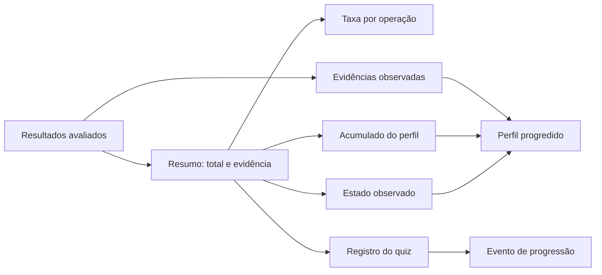

# Bases de prova das métricas de aprendizagem e avaliação

Documento de rastreabilidade das métricas que já aparecem no Cognoscere/Lumira. O objetivo é distinguir cálculo pedagógico real, contrato documentado e valor demonstrativo da interface.

**Escopo verificado:** `src/main.js`, `inicio.rb`, `public/okf/prompt-response-analysis.md`, `public/okf/progression-taxonomy.md` e a fixture pública de análise. **Data da verificação:** 20/07/2026.

## Conclusão executiva

Há duas camadas com estatutos diferentes:

1. O runtime Ruby possui cálculo direto de evidência textual, taxa por operação, acumulado e estado observado do perfil.
2. A SPA Lumira apresenta valores simulados e uma pré-análise local; ela ainda não persiste respostas nem conecta o resultado do quiz ao perfil.

Portanto, os números visíveis na interface não devem ser tratados como medições produzidas pelo runtime Ruby até que exista a integração prevista no próprio [README](../README.md).

## Matriz de evidências

| Métrica/indicador | Base direta | Cálculo ou valor observado | Estatuto atual | Interpretação segura |
| --- | --- | --- | --- | --- |
| Taxa de sustentação textual | `StudentProfileEntity#summarize` em [`inicio.rb`](../inicio.rb#L643) | `with_evidence / total × 100`, arredondado a 1 casa | Calculada no runtime Ruby | Percentual da sondagem aplicada; não é nota definitiva |
| Taxa por operação cognitiva | [`inicio.rb`](../inicio.rb#L651) | total e respostas com evidência para cada operação | Calculada no runtime Ruby | Mostra onde a evidência aparece ou falta |
| Aproveitamento acumulado | `update_accumulated!` em [`inicio.rb`](../inicio.rb#L693) | respostas com evidência acumuladas / tentativas acumuladas × 100 | Calculada no perfil Ruby | Histórico agregado, condicionado aos registros recebidos |
| Estado observado | [`state_for`](../inicio.rb#L742) | `<40`, `40–<70`, `70–<90`, `≥90` | Calculado no runtime Ruby | Estado daquela aplicação, não diagnóstico permanente |
| Evidências observadas | [`update_observed_evidence!`](../inicio.rb#L714) | Só resultados com `evidencia_textual_suficiente` geram registro | Calculada no perfil Ruby | Registro qualitativo associado à operação e observação humana |
| Progressão e eventos | [`apply_quiz_results!`](../inicio.rb#L602) | grava quiz, acumulado, evidências, reforços, estado e evento | Calculada no runtime Ruby | Requer resultados avaliados e contexto BNCC |
| Barras de competência da SPA | [`progress`](../src/main.js#L12) e [`profile`](../src/main.js#L31) | valores demonstrativos `69%` e `52%` | Mock visual | Ilustração de uma estimativa; não vem do quiz executado na tela |
| Competências ativas | [`home`](../src/main.js#L16) | valor fixo `4` | Mock visual | Não é contagem calculada em runtime |
| Sequência de estudo | [`home`](../src/main.js#L12) | valor fixo `6 dias` | Mock visual | Não há histórico de sessões na SPA |
| Reputação social | [`state`](../src/main.js#L3) | inicia em `248` | Estado demonstrativo | Domínio social; não altera competência |
| Voto de post | [`vote`](../src/main.js#L36) | incrementa `postScore` | Interação demonstrativa | A reputação visual do post muda; não é avaliação pedagógica |
| Quiz da SPA | [`quiz`](../src/main.js#L34) e [`answer`](../src/main.js#L36) | 5 questões/8 min exibidos; resposta só dispara feedback | Fluxo demonstrativo | Não há escore persistido nem atualização de perfil |
| Pré-análise aberta | [`analyzeCourseAnswer`](../src/main.js#L29) | resposta mínima de 40 caracteres; busca local por pistas | Heurística local | Indício de sustentação textual, sujeito à revisão humana |

## Fórmulas e regras observáveis

### Taxa de sustentação textual

Para um conjunto `results`:

```text
total = número de respostas
with_evidence = respostas com evidencia_textual_suficiente verdadeira
evidence_rate = round(with_evidence / total × 100, 1)
```

Quando `total` é zero, o runtime retorna `0.0`. A mesma lógica é aplicada por operação cognitiva e no acumulado do perfil.

### Estados observados da sondagem

| Faixa | Estado produzido |
| --- | --- |
| `0 ≤ taxa < 40` | necessita reforço estruturado |
| `40 ≤ taxa < 70` | domínio em formação, com necessidade de justificar por pistas textuais |
| `70 ≤ taxa < 90` | domínio funcional observado, com reforço pontual |
| `90 ≤ taxa ≤ 100` | domínio consistente observado na sondagem aplicada |

Essas faixas são diretamente implementadas em [`state_for`](../inicio.rb#L742) e também descritas na [taxonomia de progressão](../public/okf/progression-taxonomy.md). Elas não autorizam converter uma única aplicação em uma classificação definitiva.

### Unidade de evidência

Cada evidência observada no perfil Ruby preserva:

- identificador do item;
- operação cognitiva;
- evidência de domínio;
- observação humana;
- data do registro.

O resultado da análise pública segue a mesma separação: a fixture [`analysis-demo.json`](../public/okf/courses/leitura-critica-em-rede/materials/ef69lp01-praca-central/analysis-demo.json) exige revisão humana, marca `progression.effect` como `none` e declara que não contém resposta real de estudante.

## Fluxo de prova implementado

O diagrama abaixo representa somente o caminho existente no runtime Ruby; a interface pública é uma projeção demonstrativa e não uma persistência alternativa.



## Separação entre aprendizagem, avaliação e social

| Domínio | O que pode provar | O que não pode provar |
| --- | --- | --- |
| Aprendizagem/competência | evidência textual suficiente, operação observada, taxa e estado da sondagem | domínio permanente a partir de um item |
| Avaliação | resposta, rubrica, observação humana e decisão registrada | decisão autônoma de IA sem revisão |
| Reputação social | contribuição e voto em post/comentário | competência curricular |
| Competição | desempenho segundo rubrica e ranking local | progressão automática de competência |

Essa separação é coerente com [`PLATAFORMA.md`](../PLATAFORMA.md#domínios-independentes) e com os invariantes da [análise de respostas](../public/okf/prompt-response-analysis.md#invariantes).

## Lacunas que a documentação deixa explícitas

- A SPA ainda renderiza métricas de demonstração hardcoded; não há API, banco, autenticação ou persistência real.
- A função `answer` da SPA não calcula acerto acumulado nem chama `StudentProfileEntity`.
- A pré-análise local apenas procura pistas textuais e não altera o perfil; o contrato público exige revisão humana.
- Reputação, placar e competência permanecem domínios separados por regra de produto.
- Antes de uso institucional, a integração deve persistir a resposta privada, a rubrica, o avaliador, a data, a versão do instrumento e a possibilidade de revisão.

## Verificação

As bases acima foram conferidas por leitura direta dos trechos citados e pela validação existente do projeto. Para repetir a validação estrutural do bundle e o build da interface:

```bash
npm run check
```
