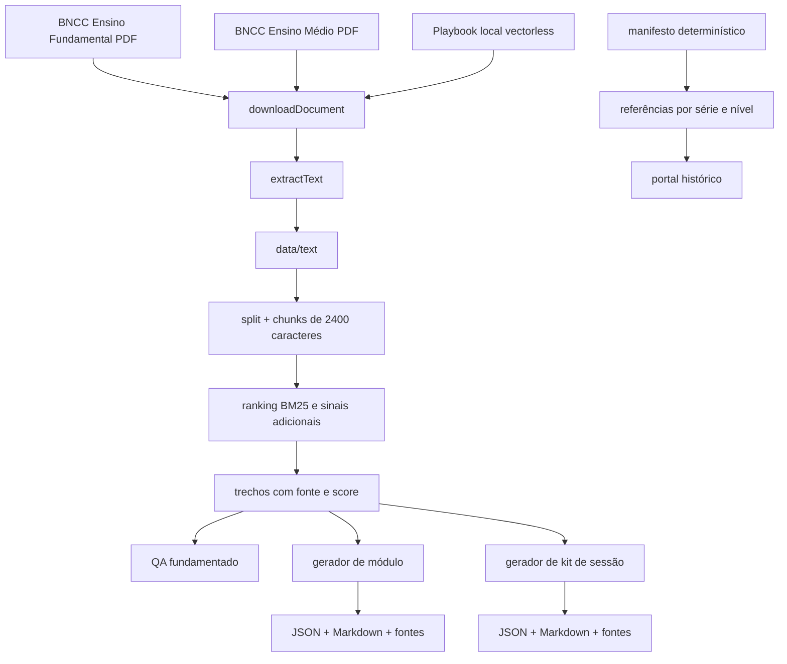
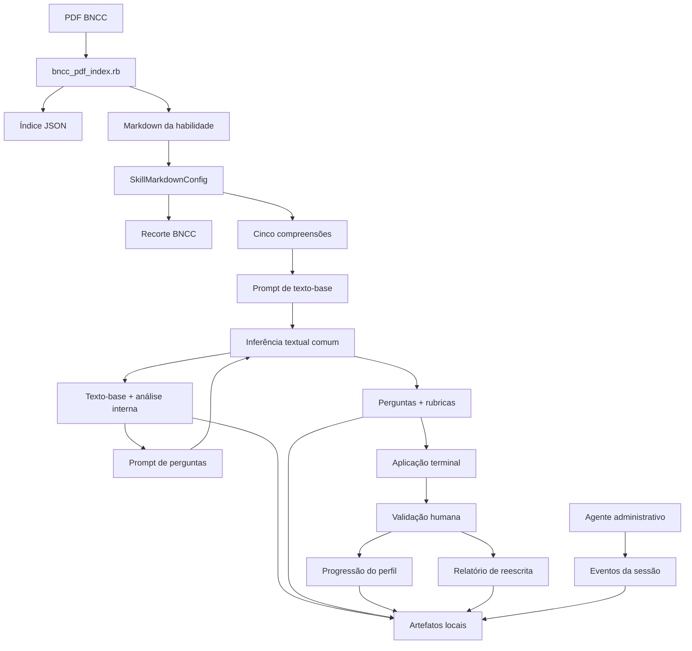
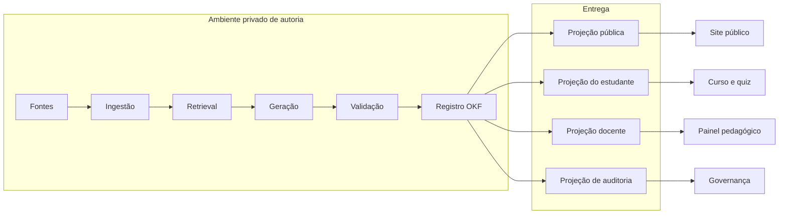

# 01 — Arquitetura e linhagem histórica

## Objetivo

Este capítulo registra de onde vem a inteligência pedagógica do Cognoscere e como o Open Knowledge Format v0.1 reconstruído deve representar a arquitetura sem apagar sua evolução.

## Base OKF local legada

O projeto possuía uma base OKF em pasta local, mas essa pasta não foi incluída nos commits disponíveis. O conteúdo original não está presente na árvore atual, no reflog nem como objeto recuperável pelo Git local analisado.

Há continuidade semântica verificável nos seguintes remanescentes:

- separação de conhecimentos por habilidade em `habilidades/*.md`;
- divisão entre contexto, compreensão, instrução e saída em `inicio.rb`;
- proveniência BNCC e índices em `data/`;
- contratos de fonte, módulo, sessão e referência no commit `40e135d`.

Esses remanescentes fundamentam a reconstrução, mas não provam nomes de campos, layouts ou versões da base local perdida. Sempre que esta documentação introduz um envelope ou campo novo, ele é identificado como contrato proposto do v0.1.

## Linha do tempo verificável

### Commit `40e135d`: projeto Node/TypeScript

O primeiro commit continha um projeto completo em `src/` com:

- ingestão de PDFs da BNCC;
- extração e normalização de texto;
- retrieval lexical sem embeddings;
- perguntas e respostas baseadas em trechos;
- geração de playbook a partir de transcrição;
- geração de módulos de produção;
- kits de sessões particulares e nivelamento;
- referências por competência, série e nível;
- portal HTML com cursos, materiais, perfil e comunidade.

O modelo padrão era configurado por `GEMINI_MODEL`, com valor de exemplo `gemini-2.5-flash`. A chamada usava a SDK `@google/genai`. Essa configuração é histórica, não uma recomendação atual de modelo.

### Commit `65ee97e`: remoção do projeto original

Esse commit removeu o `README.md`, `package.json`, `tsconfig.json` e todos os arquivos TypeScript do primeiro commit. Por isso, o estado atual não contém retrieval, gerador de módulo ou gerador de kit de sessão em execução.

Os arquivos históricos continuam recuperáveis por objeto Git, por exemplo `40e135d:src/modules.ts`. A migração deve ser seletiva; restaurar todo o commit sobrescreveria a aplicação web atual.

### Commit `9720dbe`: motor Ruby/JRuby

Esse commit introduziu:

- `inicio.rb`;
- `scripts/bncc_pdf_index.rb`;
- `habilidades/ef69lp01.md`;
- `habilidades/geradas/ef69lp01.md`;
- índices e exemplo de texto-base em `data/`;
- integração local com `glauco-framework` e `llama-server`.

O motor Ruby acrescentou separação explícita entre compreensões e instruções, geração em duas fases, validação humana, progressão de perfil, relatório de reescrita e administração por eventos.

### Commit `65556e2` e evoluções seguintes: aplicação web

A interface Vite/Lumira atual foi criada como SPA estática e evoluiu até o layout full-width com chat social flutuante. O curso `leitura-critica-em-rede` já resolve o manifesto e os artefatos de `public/okf/` por `src/okf-client.js`; quiz avulso, competências, perfil e comunidade ainda usam dados demonstrativos definidos em `src/main.js`.

## Arquitetura histórica TypeScript



### Responsabilidades por arquivo

| Arquivo histórico | Responsabilidade |
| --- | --- |
| `src/sources.ts` | Catálogo, tags e peso das fontes |
| `src/download.ts` | Download ou resolução de fonte local |
| `src/extract.ts` | Extração PDF e normalização |
| `src/repository.ts` | Orquestração de ingestão |
| `src/chunking.ts` | Segmentação, tokenização e score |
| `src/retrieval.ts` | Seleção e formatação dos trechos |
| `src/qa.ts` | Resposta limitada às fontes |
| `src/playbooks.ts` | Transcrição e síntese do playbook |
| `src/modules.ts` | Módulo BNCC orientado por competência |
| `src/sessions.ts` | Kit de sessão e sondagem |
| `src/reference-pipeline.ts` | Manifesto e docs de referência |
| `src/ui.ts` | Projeção de cursos, níveis e materiais |
| `src/types.ts` | Contratos TypeScript |
| `src/index.ts` | CLI |

## Arquitetura atual Ruby



## Fronteiras obrigatórias

### Fonte normativa

A BNCC é fonte normativa. Textos gerados são derivados pedagógicos e não devem ser apresentados como redação oficial.

### Motor de geração

O motor produz artefatos candidatos. Ele não aprova conteúdo nem decide sozinho a progressão em situação sensível.

### Agente administrativo

No desenho atual, o agente RLM deve apenas registrar etapas. Ele não gera texto-base, perguntas ou relatório. O OKF preserva essa separação por `actor_role` e `event_type`.

### Aplicação web

O GitHub Pages entrega arquivos estáticos. Ele não pode executar o motor Ruby local, iniciar `llama-server` ou proteger uma chave de provedor. Conteúdo dinâmico exige backend; conteúdo estático exige pré-geração e revisão.

### OKF

O OKF é a camada de interoperabilidade e governança. Ele não é um novo modelo de IA nem um banco de dados. Seu papel é tornar os contratos e artefatos transportáveis, versionáveis e projetáveis por permissão.

## Arquitetura alvo conceitual



## Agregados documentais

O perfil v0.1 propõe cinco agregados:

1. **Knowledge Source** — fonte, trecho, página, licença e hash.
2. **Pedagogical Contract** — recorte, compreensões, instruções, invariantes e schema.
3. **Generated Artifact** — texto-base, perguntas, módulo ou relatório.
4. **Evidence Record** — resposta, critério observável, validação humana e efeito autorizado.
5. **Projection** — representação reduzida para um papel e uma tela.

Cada agregado pode ser atualizado separadamente, mas referências entre eles devem usar identificadores e versões imutáveis.

## Identidade e referências

Um identificador recomendado usa prefixo de tipo e UUID ou slug estável:

```text
source:bncc-ef-2018
skill:ef69lp01
contract:text-base:ef69lp01:v1
artifact:text-base:01J...
artifact:question-set:01J...
evidence:response:01J...
projection:course-axis:argumentacao:v1
```

O identificador não deve incluir nome do estudante. A relação com usuário deve permanecer em domínio privado por identificador pseudônimo.

## Compatibilidade entre taxonomias

O repositório contém três nomenclaturas de nível:

| Fonte | Níveis |
| --- | --- |
| Módulo histórico | Novato, Capacidade intuitiva, Capacidade plena, Já aprendeu na escola, Dominante |
| Referência histórica | Exploratório, Emergente, Operacional, Consistente, Transferente |
| Plataforma atual | Iniciação, Apropriação, Consolidação, Proficiência, Domínio |

O OKF não deve fundi-las silenciosamente. Cada registro deve conter:

- `scale_id`;
- `scale_version`;
- `level_id` original;
- `display_label`;
- mapeamento opcional, explicitamente revisado.

Um mapeamento visual pode aproximar os cinco níveis, mas não deve alterar resultados históricos sem decisão pedagógica registrada.

## Decisões de migração

### Preservar do projeto histórico

- algoritmo de retrieval e proveniência dos trechos;
- contratos de módulo e sessão;
- modelo `Track → Level → Material → Reference`;
- produção conjunta de artefato e arquivo de fontes;
- distinção entre material, atividade, social, projeto e portfólio.

### Preservar do motor atual

- compreensões externas em Markdown;
- geração do texto-base antes das perguntas;
- texto-base imutável na segunda chamada;
- validação humana de evidência;
- separação do administrador;
- relatório de reescrita;
- armazenamento de contextos e instruções usados.

### Não restaurar diretamente

- `src/ui.ts` histórico, porque conflita com o Vite atual;
- chave de API no navegador;
- caminhos Windows como contrato de implantação;
- saída de modelo sem schema e revisão;
- dados identificáveis em artefato público.

## Registro de decisão arquitetural

| Decisão | Motivo |
| --- | --- |
| OKF v0.1 começa como reconstrução documentada | A base local legada não foi versionada nem está recuperável |
| Perfil deriva de duas gerações do próprio repo | Evita inventar uma arquitetura desconectada |
| Geração fica fora do GitHub Pages | Segurança e limitação do runtime estático |
| Projeções são separadas do documento canônico | Minimização e controle de acesso |
| Chain-of-thought é excluído | Não é necessário para auditoria e não deve ser exposto |
| Evidência humana é evento de primeira classe | O fluxo atual já depende dela para progressão |
