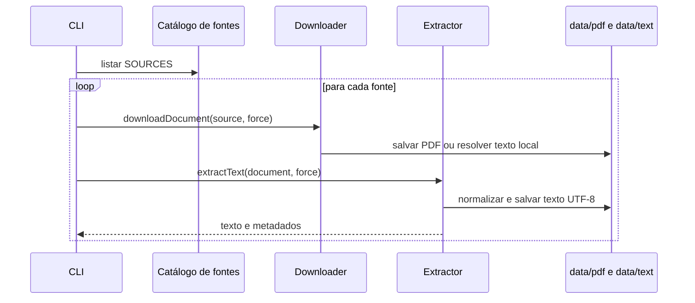
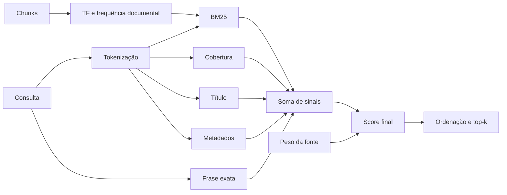

# 02 — Fontes e retrieval vectorless

## Objetivo

Este capítulo transforma o pipeline de fontes do commit `40e135d` e o indexador BNCC atual em um contrato OKF v0.1 rastreável.

## Catálogo de fontes encontrado

O projeto histórico declarava três fontes:

| ID histórico | Tipo | Conteúdo | Peso |
| --- | --- | --- | --- |
| `bncc-ef-2017` | PDF | BNCC da Educação Infantil e Ensino Fundamental | `1.1` |
| `bncc-em-2018` | PDF | BNCC do Ensino Médio | `1.1` |
| `vectorless-rag-private-sessions-playbook` | texto local | Playbook reconstruído de vídeo | `1.3` |

O estado atual contém o PDF `BNCC_EI_EF_110518_versaofinal_site.pdf`, índices JSON e referência de página para EF69LP01. O JSON atual preserva caminho absoluto de geração; o OKF deve substituí-lo por identificador de fonte, URL canônica quando conhecida, hash e caminho relativo opcional.

## Tipos de fonte

```text
Source
  source_id
  source_type: normative | operational | generated_reference
  title
  canonical_uri
  local_locator
  media_type
  edition
  published_at
  retrieved_at
  content_hash
  tags[]
  source_weight
  rights
```

### Fonte normativa

É um documento oficial usado para justificar alinhamento curricular. O campo `source_type` deve ser `normative`.

### Fonte operacional

É material sobre processo, como o playbook Vectorless RAG. Ele pode orientar estratégia, mas não fundamenta habilidade BNCC.

### Referência gerada

É um documento derivado e versionado, como as referências por série e nível do projeto histórico. Deve apontar para as fontes e contratos de origem.

## Fluxo de ingestão histórico



O comportamento histórico evitava baixar ou extrair novamente quando o arquivo já existia, salvo com `force`. Esse cache deve ser acompanhado por hash; existência de arquivo não garante que a edição seja a mesma.

## Indexador BNCC atual

`scripts/bncc_pdf_index.rb`:

- extrai texto com `pdf-reader`;
- infere área e componente a partir dos títulos;
- encontra códigos no padrão `EF...`;
- associa página, área, componente e enunciado;
- filtra por área, componente ou habilidade;
- gera índice JSON;
- pode gerar Markdown inicial da habilidade.

O contrato de habilidade resultante inclui:

```text
SkillSlice
  code
  stage
  grade_band
  area
  component
  field
  language_practice
  knowledge_object
  statement
  source_id
  source_page
```

Campos vazios, como `field`, não devem ser preenchidos por suposição silenciosa. O status de cada campo deve indicar `extracted`, `curated`, `generated` ou `missing`.

## Segmentação histórica

O arquivo `src/chunking.ts` do commit inicial:

1. normalizava quebras de linha;
2. detectava títulos Markdown, títulos em caixa alta e numeração de seção;
3. dividia o texto em parágrafos;
4. agrupava parágrafos em chunks de até 2.400 caracteres;
5. dividia parágrafos maiores mecanicamente;
6. carregava o título corrente para o chunk.

Um trecho OKF deve registrar a transformação:

```text
RetrievalExcerpt
  excerpt_id
  source_ref
  chunk_index
  heading
  content
  offsets
  segmentation
    algorithm: paragraph_heading_buffer
    max_characters: 2400
    version
  content_hash
```

Os offsets não existiam no tipo histórico, mas são propostos para verificação futura. Quando indisponíveis, o campo deve ser explicitamente ausente, não inventado.

## Tokenização

O retrieval histórico:

- convertia para minúsculas;
- removia diacríticos por normalização NFD;
- separava por caracteres não alfanuméricos;
- descartava tokens menores que três caracteres;
- removia um conjunto curto de stopwords em português e `the`.

O contrato deve registrar a versão do tokenizer, pois mudança de stopwords ou normalização altera o ranking.

## Score BM25 e sinais adicionais

O score lexical usava BM25 com:

```text
k1 = 1.2
b = 0.75
```

Ao BM25 eram somados:

- cobertura dos termos da consulta, multiplicada por `2`;
- `0.8` quando o título continha termo da consulta;
- `0.35` por correspondência nos metadados;
- `1.2` por frase exata, quando a consulta tinha ao menos 12 caracteres;
- multiplicação pelo `sourceWeight`.

Somente chunks com score positivo e ao menos um termo correspondente eram mantidos.



## Seleção global

`src/retrieval.ts` usava por padrão:

- quatro chunks por fonte;
- até doze trechos globais;
- score mínimo `0.5`.

O gerador de módulo alterava os limites para cinco por fonte e quatorze globais. O kit de sessão usava cinco por fonte e doze globais.

Cada trecho era apresentado ao modelo com:

- título da fonte;
- seção, quando detectada;
- índice do chunk;
- score com duas casas;
- termos encontrados;
- conteúdo.

O OKF deve preservar esses dados como campos, não apenas dentro de uma string.

## Contrato de consulta

```text
RetrievalRequest
  request_id
  query
  purpose: qa | module_generation | session_generation | skill_authoring
  source_filters[]
  stage
  area
  skill_codes[]
  parameters
    limit_per_source
    max_excerpts
    minimum_score
    tokenizer_version
    ranking_version
```

```text
RetrievalResult
  request_ref
  retrieved_at
  excerpts[]
    excerpt_ref
    rank
    score
    matched_terms[]
    source_ref
  empty_reason
```

## Invariantes de grounding

- A consulta DEVE registrar finalidade e escopo.
- O resultado DEVE manter referência para fonte e trecho.
- O gerador NÃO DEVE inventar código de habilidade ausente.
- A resposta DEVE separar fato encontrado de inferência pedagógica.
- Ausência de trecho suficiente DEVE produzir falha explícita.
- Score de retrieval NÃO É medida de verdade ou qualidade pedagógica.
- Fonte operacional NÃO DEVE ser citada como norma curricular.
- Trecho truncado NÃO DEVE ocultar a página ou o contexto necessário.

## Validação de fonte

Antes de usar uma fonte:

| Verificação | Falha |
| --- | --- |
| URI ou localizador resolve | bloquear ingestão |
| hash corresponde ao registro | criar nova revisão ou bloquear |
| texto extraído não está vazio | bloquear retrieval |
| edição e título estão identificados | manter em revisão |
| páginas são preservadas quando aplicável | não publicar alegação de página |
| tipo normativo está confirmado | rebaixar para operacional |

## Proveniência de um artefato

```text
Provenance
  source_refs[]
  excerpt_refs[]
  retrieval_request_ref
  skill_ref
  contract_ref
  generator
    provider
    model
    parameters
  generated_at
  input_hash
  output_hash
```

O modelo e os parâmetros devem ser registrados no ambiente privado. A projeção pública pode mostrar apenas nome do processo, data, fontes e versão aprovada.

## Prevenção de prompt injection em fontes

Texto recuperado é dado, não instrução. O montador de prompt deve:

- delimitar trechos como referência não executável;
- ignorar comandos encontrados dentro da fonte;
- impedir que fonte altere schema, papel ou política;
- limitar tamanho e tipos de arquivo;
- registrar sanitização aplicada;
- marcar conteúdo de origem não confiável.

## Testes mínimos do retrieval

1. Acentos: `evidência` deve corresponder a `evidencia`.
2. Stopwords: consulta composta apenas por stopwords deve retornar vazio seguro.
3. Título: chunk com título correspondente recebe o bônus esperado.
4. Peso: mesma evidência em fonte de maior peso altera score de modo previsível.
5. Proveniência: todo resultado possui fonte e índice.
6. Limites: top-k e score mínimo são respeitados.
7. Determinismo: mesmos textos, consulta e versão geram mesma ordem.
8. Injeção: instrução dentro de trecho não muda o contrato de geração.

## Migração do retrieval histórico

Para recuperar a capacidade sem conflitar com o Vite atual:

- portar `sources.ts`, `chunking.ts` e `retrieval.ts` para um pacote de ferramentas ou serviço privado;
- não recolocar a chave Gemini no frontend;
- adicionar hash, offsets e versão do ranking;
- produzir documentos OKF de `source`, `retrieval_request` e `retrieval_excerpt`;
- manter fixtures com pequenos trechos licenciados ou referências, não cópias integrais desnecessárias;
- testar o ranking histórico antes de alterar pesos.
