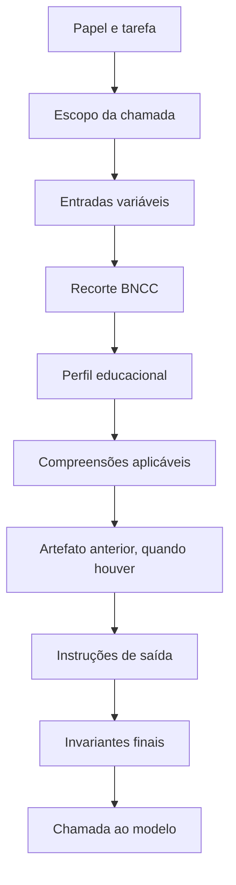

# 03 — Compreensões e instruções

## Objetivo

O motor atual diferencia o que uma tarefa significa pedagogicamente de como o modelo deve formatar uma saída. O OKF v0.1 reconstruído transforma essa distinção em contrato explícito.

Essa documentação trata apenas de contexto fornecido, instruções, invariantes, saídas e validação. Ela não descreve, solicita ou armazena chain-of-thought do modelo.

## Origem verificável

`habilidades/ef69lp01.md` possui seis seções:

1. `recorte_bncc`;
2. `bncc_context_comprehension`;
3. `text_base_comprehension`;
4. `text_base_internal_analysis_comprehension`;
5. `question_topic_comprehension`;
6. `rewrite_report_comprehension`.

`SkillMarkdownConfig` em `inicio.rb` lê essas seções e as separa do bloco de instruções. Os builders de prompt reúnem os elementos somente no momento de cada chamada.

## Definições

### Compreensão

Texto curado que descreve sentido, escopo, critérios pedagógicos, limites interpretativos e evidências esperadas. É entrada explícita da tarefa e pode ser revisada por especialistas.

Uma compreensão não é raciocínio interno do modelo. Ela é parte do contrato de autoria.

### Instrução

Regra operacional que especifica ação, formato, campos, quantidade, restrições e comportamento diante de falhas.

### Invariante

Condição que deve permanecer verdadeira independentemente da redação gerada. Exemplo: as perguntas não podem alterar o texto-base recebido.

### Schema de saída

Estrutura verificável do artefato. JSON sintaticamente válido é apenas a primeira validação; o conteúdo ainda precisa cumprir invariantes e revisão pedagógica.

### Contexto de execução

Dados variáveis inseridos na chamada, como recorte BNCC, perfil educacional, tema, observação humana e artefato anterior.

## Cinco compreensões do motor atual

### Contexto BNCC

Transforma o enunciado curricular em leitura pedagógica situada. Deve explicitar:

- o que o estudante precisa compreender, fazer ou demonstrar;
- quais conceitos ou práticas estão em jogo;
- quais evidências tornam a habilidade observável;
- quais limites impedem deslocamento para outra habilidade.

### Texto-base

Define a função da situação de leitura. No caso atual, exige:

- situação concreta, não pretexto decorativo;
- extensão suficiente para avaliação;
- participantes e interesses específicos;
- fatos, contexto e consequências;
- moldura argumentativa;
- adequação à série.

### Análise interna do texto-base

Descreve quais campos analíticos devem acompanhar o texto gerado:

- função das partes;
- pistas textuais;
- trechos relevantes;
- erro provável;
- operações cognitivas;
- evidências de uma resposta consistente.

Apesar do nome histórico “compreensão interna”, esse conteúdo é uma análise estruturada e auditável solicitada como saída. Não é chain-of-thought.

### Tópico das perguntas

Delimita o que as perguntas podem observar e como devem exigir evidência do texto fixado.

### Relatório de reescrita

Define como separar problema do estudante, da pergunta, do texto-base e do próprio contrato de geração.

## Instruções existentes

`inicio.rb` possui três blocos principais:

| Bloco | Produto |
| --- | --- |
| `TEXT_BASE_GENERATION_INSTRUCTIONS` | texto-base, abstrações e compreensão-base em JSON |
| `QUESTION_GENERATION_INSTRUCTIONS` | conjunto de perguntas abertas e rubricas em JSON |
| `REWRITE_REPORT_INSTRUCTIONS` | relatório textual em dez seções |

Há também a instrução administrativa de `run_admin_step!` e a instrução de reparo de JSON.

## Ordem de montagem



Essa ordem é importante porque:

- o escopo antecede o formato;
- o modelo recebe a base pedagógica antes do schema;
- a segunda fase recebe texto e análise já fixados;
- instruções finais reiteram quantidades e proibições críticas.

## Contrato conceitual de prompt

```text
PromptContract
  contract_id
  contract_version
  task_type
  status
  role
  purpose
  scope
  input_schema
  context_blocks[]
    block_id
    block_type
    source_ref
    content_hash
    visibility
  instruction_blocks[]
    block_id
    instruction_type
    content_hash
  invariants[]
  output_schema_ref
  validation_policy_ref
  retry_policy_ref
  model_policy_ref
  created_by
  reviewed_by
  approved_at
```

## Tipos de bloco

| Tipo | Exemplo | Pode aparecer ao estudante? |
| --- | --- | --- |
| `normative_context` | recorte BNCC | somente projeção resumida |
| `pedagogical_comprehension` | compreensão da habilidade | não por padrão |
| `learner_context` | série e necessidades educacionais | apenas campos mínimos privados |
| `human_observation` | observação inicial | privado |
| `fixed_artifact` | texto-base da fase anterior | sim, na projeção do material |
| `generation_instruction` | schema e regras | não |
| `safety_instruction` | limites e bloqueios | não |
| `validation_instruction` | critérios de aprovação | painel autorizado |

## Contratos por tarefa

### Texto-base

Entradas:

- recorte BNCC;
- perfil educacional;
- tema;
- observação humana inicial;
- três compreensões: BNCC, texto-base e análise interna.

Saída:

- abstrações narrativas;
- texto-base estruturado;
- compreensão-base estruturada.

Invariantes:

- não gerar perguntas;
- não gerar gabarito;
- manter 550–750 palavras como referência atual;
- usar situação plausível para a série;
- deixar pistas suficientes;
- separar início, centro e fechamento.

### Perguntas

Entradas:

- recorte BNCC;
- perfil educacional;
- tema e quantidade;
- texto-base fixado;
- compreensão-base fixada;
- compreensão do tópico.

Saída:

- metadados curriculares;
- cópia do texto-base recebido;
- perguntas abertas;
- resposta de referência;
- rubrica e evidências esperadas.

Invariantes:

- não gerar outro texto-base;
- não alterar gênero, título ou conteúdo;
- quantidade exata;
- somente resposta aberta;
- exigir justificativa textual;
- não usar resposta de referência como única redação válida.

### Reescrita

Entradas:

- todas as compreensões usadas;
- texto-base e análise;
- quiz;
- resultados e observações.

Saída:

- relatório em dez seções;
- diagnóstico por camada;
- recomendações;
- versão sugerida das compreensões.

Invariante:

- não atribuir automaticamente toda falha ao estudante.

### Administração

Entradas:

- nome da etapa;
- payload mínimo do evento.

Saída:

- registro da etapa e confirmação.

Invariantes:

- não gerar conteúdo pedagógico;
- não substituir a inferência textual;
- não modificar resultado.

## Composição e herança

O OKF recomenda composição explícita, não concatenação opaca:

```text
contract:text-base:ef69lp01:v1
  includes skill:ef69lp01:v1
  includes comprehension:bncc-context:ef69lp01:v1
  includes comprehension:text-base:ef69lp01:v2
  includes comprehension:text-analysis:ef69lp01:v1
  includes instruction:text-base-output:v3
  validates-with schema:text-base:v2
```

Se um bloco muda, o contrato composto recebe nova versão ou novo hash. Artefatos antigos continuam apontando para os blocos usados na geração original.

## Hierarquia de autoridade

Uma política futura deve aplicar esta ordem:

1. segurança, privacidade e autorização;
2. contrato de tarefa aprovado;
3. fonte normativa;
4. compreensão pedagógica curada;
5. entrada humana da sessão;
6. fonte recuperada;
7. texto livre de usuário.

Conteúdo de fonte e entrada de usuário nunca deve substituir instruções de segurança ou schema.

## Invariantes transversais

| Invariante | Verificação |
| --- | --- |
| Código BNCC não inventado | deve existir no recorte ou índice aprovado |
| Texto fixado não alterado | comparar hash e campos canônicos |
| Quantidade exata | contar itens |
| Resposta aberta | proibir alternativas e gabarito por letra |
| Evidência rastreável | exigir pistas ou trecho de referência |
| Projeção mínima | validar allowlist por papel |
| Sem chain-of-thought | bloquear campos como `reasoning_trace` e conteúdo equivalente |
| Sem credencial | scanner de segredo antes de persistir/publicar |
| Humano identificável por papel | registrar ator, não segredo ou nome em projeção pública |

## Validação dos blocos

Uma compreensão deve passar por:

- revisão de clareza e escopo;
- checagem contra o recorte BNCC;
- revisão de adequação etária;
- teste com casos positivos e negativos;
- análise de vieses e riscos;
- aprovação pedagógica;
- versionamento e hash.

Uma instrução deve passar por:

- validação de schema;
- teste de quantidade e tipos;
- teste de recusa a alterar artefato fixado;
- teste de saída truncada;
- teste de injeção em conteúdo recuperado;
- teste de compatibilidade com o parser.

## Mudança de contrato

Mudanças semânticas exigem versão maior do documento ou revisão explicitamente incompatível:

- mudança da habilidade observada;
- mudança de público ou série;
- mudança da definição de domínio;
- inclusão ou remoção de campo obrigatório;
- mudança de escala de nível.

Mudanças editoriais compatíveis podem usar revisão menor:

- correção ortográfica;
- melhoria de título;
- descrição sem alteração de critério;
- exemplo adicional sem efeito no schema.

## Registro de execução sem raciocínio interno

Um registro suficiente contém:

```text
ExecutionRecord
  execution_id
  contract_ref
  input_refs[]
  source_refs[]
  model_id
  parameters
  started_at
  completed_at
  output_ref
  validation_results[]
  human_decisions[]
  errors[]
```

Não contém pensamentos privados do modelo. Para justificar o resultado, usa:

- critérios selecionados;
- evidências citadas;
- classificação produzida;
- validações que passaram ou falharam;
- decisão humana posterior.

## Checklist de autoria

- [ ] A tarefa possui propósito único.
- [ ] O recorte BNCC está referenciado.
- [ ] Compreensões estão separadas das instruções.
- [ ] Entradas privadas estão classificadas.
- [ ] Artefatos anteriores têm hash.
- [ ] Invariantes podem ser testados.
- [ ] O schema não solicita chain-of-thought.
- [ ] A política de falha está definida.
- [ ] Há revisor pedagógico.
- [ ] O contrato possui versão e estado.
