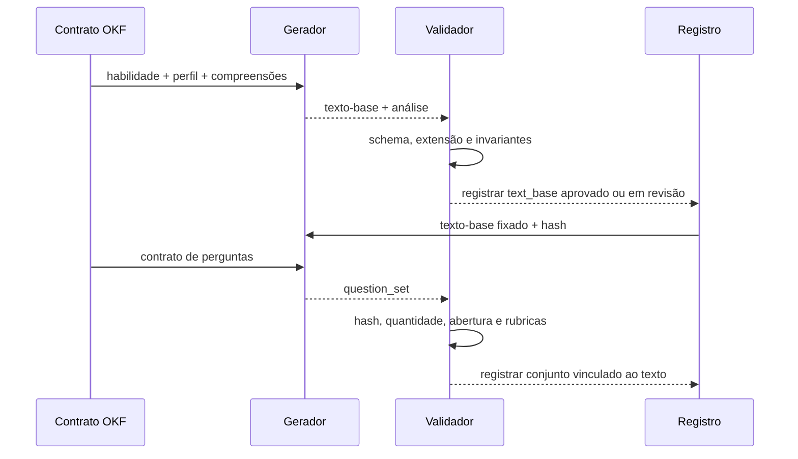
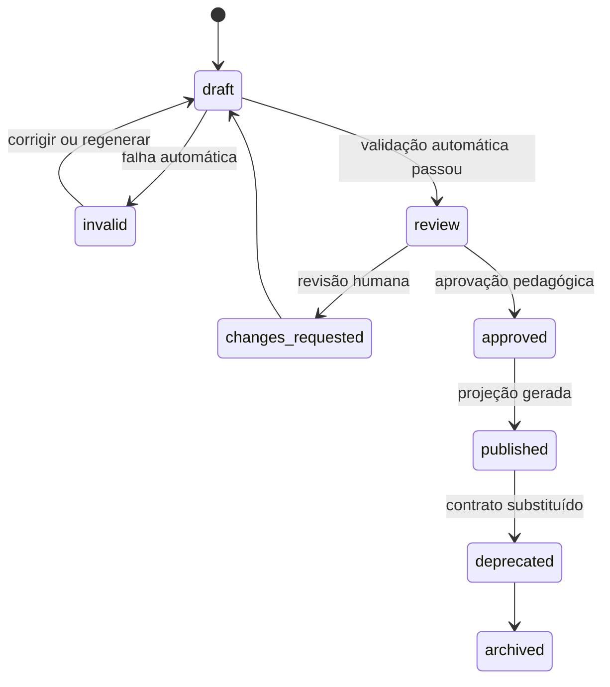

# 04 — Geração de conteúdo pedagógico

## Objetivo

Este capítulo reúne os contratos de geração encontrados no projeto histórico e no motor atual. O foco é documentar entradas, invariantes, saídas e validação de módulo, texto-base e perguntas.

## Famílias de geração

| Família | Implementação encontrada | Estado |
| --- | --- | --- |
| Módulo de produção | `40e135d:src/modules.ts` | histórica, não presente na árvore atual |
| Kit de sessão | `40e135d:src/sessions.ts` | histórica, documentada nos capítulos 04 e 05 |
| Texto-base | `inicio.rb` | atual |
| Perguntas diagnósticas | `inicio.rb` | atual |
| Referência por série e nível | `40e135d:src/reference-pipeline.ts` | histórica e determinística |

## Geração de módulo de produção

### Propósito histórico

O gerador criava módulo educacional inspirado na filosofia Lumira:

- aprendizagem por competência;
- prática antes da teoria abstrata;
- produção concreta;
- progressão por níveis;
- eventos, desafios, peer review e avaliação assistida;
- IA como mediadora de entendimento público;
- rastreabilidade e verificação humana.

### Entrada conceitual

```text
ModuleGenerationInput
  title
  stage
  area
  theme
  audience?
  module_type?
  duration?
  retrieval_result_ref
```

A busca histórica concatenava esses campos com termos sobre competências, habilidades, práticas, avaliação, projeto e produção.

### Saída histórica

```text
Module
  module_title
  stage
  area
  theme
  module_type
  duration
  bncc_alignment[]
    source_document
    skill_or_axis
    justification
  competency_focus[]
  competency_pipeline[]
    competency_name
    competency_purpose
    bncc_connection
    levels[]
      level
      student_readiness
      challenge_scope
      expected_evidence
  production_challenge
    driving_question
    final_deliverable
    real_world_context
  lumira_progression[]
  assessment
    peer_review[]
    ai_support[]
    teacher_observation[]
  responsible_ai_public_use
  module_outputs[]
  implementation_notes[]
```

### Artefatos históricos

O processo produzia três arquivos:

- JSON canônico;
- Markdown legível;
- Markdown de fontes e trechos selecionados.

O perfil OKF mantém a separação entre conteúdo e proveniência, mas usa referências estruturadas entre documentos.

### Invariantes

- usar apenas os trechos BNCC fornecidos como base normativa;
- declarar quando algo não está explícito na BNCC;
- não inventar código de habilidade;
- cada competência deve possuir níveis;
- cada nível deve explicitar prontidão, desafio e evidência;
- uso de IA deve incluir limites, verificação e rastreabilidade.

## Geração do texto-base atual

### Propósito

Produzir uma situação completa na qual a habilidade seja necessária e observável antes de formular perguntas.

### Entrada

```text
TextBaseGenerationInput
  skill_ref
  student_profile_ref
  theme
  initial_human_observation
  comprehension_refs
    bncc_context
    text_base
    text_base_internal_analysis
  contract_ref
```

### Saída conceitual

```text
TextBaseArtifact
  curricular_metadata
    bncc_code
    component
    stage
    grade
    field
    theme
  narrative_abstractions
    concrete_situation
    background[]
    participants[]
      name
      social_role
      interest
      speech_mode
    ordered_facts[]
    central_tension
    opening_thesis
    argumentative_problem
    planned_clues[]
    planned_speeches[]
    closing_thesis_return
    pedagogical_consequence
  text_base
    genre
    title
    structure
      opening
      central_content
        paragraphs[]
        speeches[]
      closing
    content
  base_comprehension
    communicative_situation
    purpose
    narrative_structure
    legitimate_opinion_excerpt
    harmful_speech_excerpt
    textual_clues[]
    interpretive_boundary
    likely_student_error
    operations_to_assess[]
    mastery_evidence[]
```

Os nomes acima são normalização conceitual em inglês para interoperabilidade. A serialização futura pode preservar aliases em português. O mapeamento deve ser explícito e testado.

### Regras verificáveis

- saída em JSON;
- presença de `texto_base`, `compreensao_base` e `abstracoes_narrativas`;
- referência de 550–750 palavras;
- narrativa completa, não sinopse;
- abstrações anteriores ao texto;
- sequência causal;
- moldura argumentativa;
- conteúdo central livre para adotar forma adequada à habilidade;
- falas ligadas a interesses concretos;
- separação estrutural entre parágrafos e falas;
- adequação à série;
- pistas para perguntas posteriores.

### Divergência do exemplo atual

O arquivo `data/quiz_6ano_ef69lp01_separated_textbase.json` não contém três campos hoje exigidos pela instrução:

- `tese_de_abertura`;
- `problema_argumentativo`;
- `retomada_da_tese_no_fechamento`.

Ele deve ser classificado como artefato de contrato anterior, não validado contra o schema atual. A migração não deve preencher esses campos automaticamente sem regeneração ou curadoria.

## Geração de perguntas atual

### Dependência imutável

O conjunto de perguntas depende do hash do texto-base e da compreensão-base. Qualquer alteração no texto após a geração invalida ou desatualiza o conjunto.



### Saída conceitual

```text
QuestionSet
  curricular_metadata
  theme
  fixed_text_base_ref
  fixed_text_base_hash
  questions[]
    question_id
    response_type: open
    observed_skill
    cognitive_operation
    prompt
    student_command
    reference_response
    analysis_rubric
      observed_mastery
      emerging_mastery
      no_textual_evidence
      comprehension_error
      mediation_needed
    expected_textual_clues[]
    human_intervention
    likely_error
    mastery_evidence
    profile_update_candidate
```

### Invariantes

- quantidade exata solicitada;
- somente perguntas abertas;
- nenhuma alternativa ou gabarito por letra;
- pergunta ampla, mas analisável;
- justificativa apoiada no texto;
- cobertura das operações necessárias à habilidade;
- resposta de referência como parâmetro, não única resposta aceitável;
- rubrica distingue pelo menos cinco estados;
- cópia ou referência do texto corresponde ao hash fixado.

## Cobertura pedagógica EF69LP01

O contrato atual exige que o conjunto cubra:

- reconhecimento de opinião legítima;
- identificação de discurso de ódio ou ataque discriminatório;
- diferença entre crítica e ataque;
- posicionamento ou denúncia responsável;
- justificativa textual.

Essa cobertura é específica da habilidade e não deve ser generalizada para todas as competências. Novas habilidades precisam de suas próprias compreensões e operações.

## Geração de kit de sessão histórico

O gerador histórico de sessões produzia:

```text
PrivateSessionKit
  session_title
  learner_fit_summary
  question_philosophy
    summary
    design_principles[]
  vectorless_rag_strategy
    why_it_fits
    advantages[]
    tradeoffs[]
  phase_questions[]
    level_band
    goal
    questions[]
    signals_to_watch[]
  intake_questions[]
    question
    why_it_matters
    placement_signal
  evidence_and_routing
  responsible_ai_public_use
  session_flow[]
```

As perguntas deveriam ser situações hipotéticas multifacetadas, sem resposta direta, decorada ou binária. Esse princípio é compatível com a geração atual de perguntas abertas e deve integrar o contrato de análise do próximo capítulo.

## Documentos de referência determinísticos

O projeto histórico também gerava documentos sem LLM para:

- uma competência de argumentação escrita;
- séries do 6º EF à 3ª série EM;
- categorias tese, evidência, revisão e transferência;
- cinco níveis;
- pergunta âncora e refinamentos pontuados.

Esses documentos demonstram que nem todo conteúdo OKF precisa ser gerado por modelo. Regras, escalas e rubricas aprovadas devem preferir geração determinística.

## Escalas de progressão

Os três vocabulários encontrados devem receber IDs próprios:

```text
scale:historic-module:v1
scale:historic-reference:v1
scale:lumira-platform:v1
```

Um mapeamento inicial para exibição pode ser revisado assim:

| Posição | Módulo histórico | Referência histórica | Lumira atual |
| --- | --- | --- | --- |
| 1 | Novato | Exploratório | Iniciação |
| 2 | Capacidade intuitiva | Emergente | Apropriação |
| 3 | Capacidade plena | Operacional | Consolidação |
| 4 | Já aprendeu na escola | Consistente | Proficiência |
| 5 | Dominante | Transferente | Domínio |

Essa tabela é uma projeção de alinhamento, não equivalência pedagógica aprovada.

## Validação em camadas

### Camada 1 — sintaxe

- JSON válido;
- UTF-8;
- ausência de campo desconhecido quando o schema é fechado;
- tipos corretos.

### Camada 2 — estrutura

- campos obrigatórios;
- cardinalidade;
- enums;
- referências resolvíveis;
- hash do texto fixado.

### Camada 3 — invariantes

- extensão e organização;
- quantidade de perguntas;
- texto inalterado;
- perguntas abertas;
- evidências presentes;
- código BNCC conhecido.

### Camada 4 — qualidade pedagógica

- alinhamento;
- adequação etária;
- naturalidade;
- ausência de estereótipo;
- rubrica observável;
- coerência entre pergunta e evidência.

### Camada 5 — aprovação

- revisão humana;
- status `approved`;
- projeção permitida;
- registro do responsável e data.

## Estados do artefato



## Falhas e recuperação

| Falha | Ação |
| --- | --- |
| nenhum trecho recuperado | interromper e pedir recorte melhor |
| JSON truncado | tentar reparo controlado e revalidar tudo |
| texto fora da extensão | revisão ou regeneração |
| código BNCC ausente | bloquear publicação |
| texto alterado entre fases | invalidar perguntas |
| rubrica vaga | solicitar mudança humana |
| conteúdo inadequado à idade | bloquear e registrar incidente |
| modelo indisponível | manter artefato anterior; não simular sucesso |

## Critérios de publicação no curso

Um material só pode integrar curso quando:

- fonte e habilidade estão resolvidas;
- contrato e artefato possuem versão;
- validações estruturais passaram;
- revisão pedagógica está aprovada;
- projeção do estudante remove campos internos;
- acessibilidade e linguagem foram revisadas;
- perguntas apontam para o texto exato exibido;
- política de atualização define o que acontece com tentativas em andamento.
