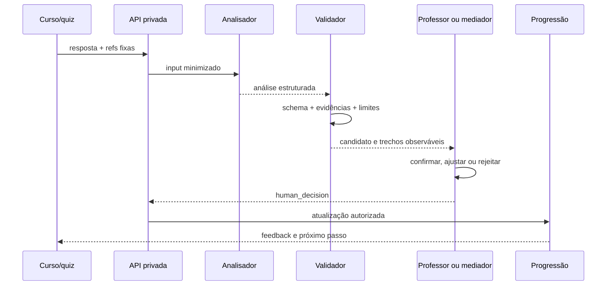
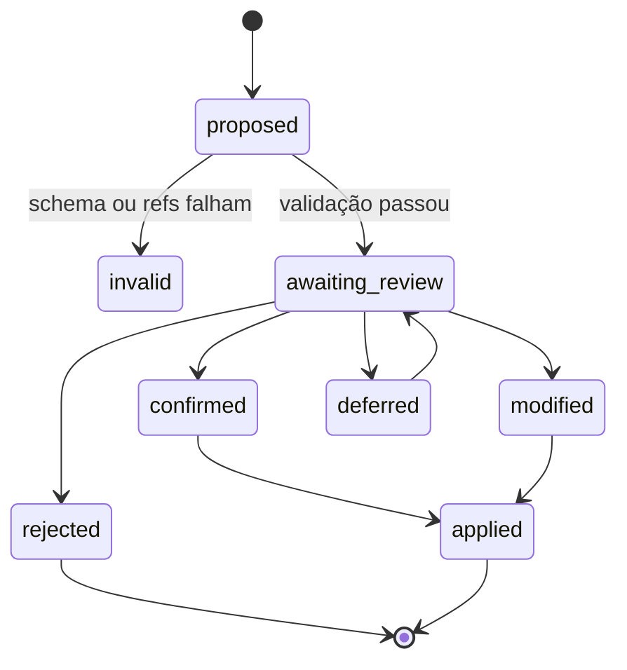

# 05 — Análise de resposta

## Status do contrato

Este capítulo define o contrato `response_analysis` para o OKF v0.1 reconstruído. A árvore atual já contém schema, projeção pública segura, fixture sintética e uma pré-análise heurística local demonstrativa no curso. Um analisador automático completo, protegido e conectado ao motor de inferência ainda não existe.

O comportamento implementado em `apply_quiz!` é:

1. apresentar pergunta e pistas esperadas;
2. coletar resposta aberta;
3. pedir a uma pessoa que indique se houve justificativa textual suficiente;
4. registrar observação humana;
5. atualizar o perfil com base nessa decisão.

O contrato mantém a decisão humana e adiciona uma análise estruturada opcional. A análise automática é apoio, não decisão final; a heurística pública atual é explicitamente demonstrativa e não equivale à inferência do Ruby.

## Objetivo

Transformar resposta, pergunta, rubrica e texto-base em sinais observáveis, rastreáveis e revisáveis, sem registrar chain-of-thought e sem produzir diagnóstico psicológico.

## Princípios

- analisar evidência no texto, não personalidade;
- distinguir ausência de evidência de erro de compreensão;
- admitir múltiplas respostas válidas;
- citar critério e pista observável;
- manter resposta integral em projeção privada;
- exigir confirmação humana para progressão;
- não alterar competência por reputação, placar ou participação social;
- não penalizar ausência como erro pedagógico, conforme a definição atual da plataforma;
- não revelar raciocínio interno do modelo.

## Dependências

Uma análise válida depende de versões fixas de:

- habilidade;
- texto-base;
- pergunta;
- rubrica;
- resposta do estudante;
- política de análise;
- escala de progressão.

Se qualquer dependência muda, a análise anterior continua histórica e uma nova revisão deve ser criada.

## Entrada proposta

```text
ResponseAnalysisInput
  analysis_request_id
  student_response_ref
  question_ref
  question_hash
  text_base_ref
  text_base_hash
  skill_ref
  rubric_ref
  learner_scope
    stage
    grade
    accessibility_preferences?
  response_text
  expected_clues[]
  reference_response
  prior_human_observation?
  policy_ref
```

### Regras de entrada

- `response_text` é dado privado.
- `learner_scope` deve conter o mínimo necessário.
- Nome, e-mail e identificadores sociais não são necessários para análise.
- `reference_response` orienta critérios, mas não é resposta literal obrigatória.
- A pergunta e o texto-base devem corresponder aos hashes registrados.
- Campo de acessibilidade só pode ajustar apresentação ou interpretação autorizada; não pode reduzir expectativa silenciosamente.

## Saída proposta

```text
ResponseAnalysis
  analysis_id
  analysis_version
  input_ref
  status
  classification
  evidence_sufficiency
  criteria[]
    criterion_id
    result: observed | partial | not_observed | not_applicable
    evidence_refs[]
    note
  textual_evidence[]
    source: student_response | text_base
    excerpt
    locator?
  missing_evidence[]
  detected_misconceptions[]
  mediation_flags[]
  feedback_candidate
    acknowledgement
    next_step
    question_for_revision?
  profile_update_candidate
    operation
    evidence_state
    suggested_reinforcement?
  confidence_band
  limitations[]
  validation
  generator
  created_at
```

## Classificação controlada

O contrato atual das perguntas já distingue cinco resultados. O OKF preserva-os como enum:

| Valor | Significado observável |
| --- | --- |
| `observed_mastery` | resposta atende ao critério e usa evidência suficiente |
| `emerging_mastery` | há compreensão parcial ou evidência incompleta |
| `no_textual_evidence` | afirmação pode ser plausível, mas não é sustentada pelo texto solicitado |
| `comprehension_error` | resposta entra em conflito com aspecto necessário da situação |
| `mediation_needed` | não há informação suficiente ou é necessária intervenção humana |

O sistema pode atribuir apenas uma classificação principal e várias flags auxiliares. Em ambiguidade, deve preferir `mediation_needed`.

## Suficiência de evidência

```text
evidence_sufficiency:
  sufficient
  partial
  absent
  unverifiable
```

Essa dimensão deve permanecer separada da classificação. Um estudante pode compreender a situação, mas responder sem citar pista textual; isso não deve ser rotulado automaticamente como erro conceitual.

## Critérios observáveis

Para EF69LP01, exemplos derivados das compreensões atuais incluem:

- identifica expressão que caracteriza ataque discriminatório;
- diferencia discordância de ataque a pessoa ou grupo;
- reconhece que liberdade de expressão não autoriza humilhação, ameaça ou discriminação;
- indica encaminhamento responsável;
- sustenta a resposta com elemento do texto-base.

O analisador deve receber esses critérios. Ele não deve inventá-los depois de ler a resposta.

## Evidência citada

Uma justificativa auditável contém trechos curtos e localizadores, não narrativa de raciocínio:

```text
criterion: textual_support
result: observed
evidence:
  student_response_excerpt: "..."
  text_base_locator: speech:participant-3
note: "A resposta relaciona a generalização ao ataque contra o grupo."
```

O campo `note` descreve a relação observável. Ele não deve conter passos mentais ocultos, hipóteses íntimas ou cadeia de pensamento.

## Fluxo proposto



## Decisão humana

```text
HumanReviewDecision
  decision_id
  analysis_ref
  reviewer_role
  decision: confirm | modify | reject | defer
  final_classification
  final_evidence_sufficiency
  selected_criteria[]
  observation
  profile_effect_authorized
  created_at
```

O nome do revisor pode permanecer em domínio administrativo separado. Projeções educacionais exibem papel e data quando necessário.

## Alteração do perfil

O `StudentProfileEntity` atual mantém:

- lista de quizzes;
- tentativas acumuladas;
- respostas com evidência;
- taxa de sustentação;
- resultado por operação;
- evidências observadas;
- reforços ativos;
- estado atual.

O analisador só propõe `profile_update_candidate`. A atualização acontece após decisão autorizada.



## Política de confiança

O valor deve ser uma faixa operacional, não uma probabilidade de inteligência ou capacidade do estudante:

| Faixa | Uso |
| --- | --- |
| `high` | evidência direta e critérios não conflitantes; ainda requer política humana definida |
| `medium` | evidência parcial ou linguagem ambígua |
| `low` | resposta curta, indireta, conflituosa ou sem contexto suficiente |
| `not_scored` | análise determinística ou não aplicável |

Confiança alta não autoriza publicação ou progressão automática por si só.

## Feedback ao estudante

O feedback pode:

- reconhecer uma evidência específica;
- apontar o que falta sem revelar resposta pronta;
- pedir retorno ao texto;
- sugerir comparação entre dois trechos;
- oferecer mediação ou acessibilidade;
- explicar o próximo passo.

O feedback não deve:

- rotular o estudante;
- afirmar incapacidade;
- expor nota privada de professor;
- reproduzir instruções internas;
- fornecer chain-of-thought do modelo;
- substituir encaminhamento de segurança quando necessário.

## Ausência, recusa e conteúdo vazio

Ausência deve ser registrada separadamente:

```text
response_state:
  submitted
  blank
  skipped
  interrupted
  inaccessible
```

Uma resposta `blank` ou `skipped` não deve ser convertida em `comprehension_error`. A plataforma atual define que ausência não pune competência.

## Segurança de conteúdo

Como EF69LP01 envolve discurso de ódio, a análise deve:

- tratar citações usadas para identificar o problema de forma diferente de endosso;
- evitar repetir conteúdo ofensivo além do necessário;
- acionar revisão humana em ameaça, risco ou denúncia real;
- não inferir pertencimento a grupo protegido;
- preservar contexto de citação;
- seguir política de proteção a menores.

## Validações automáticas

| Regra | Resultado em falha |
| --- | --- |
| referências e hashes resolvem | análise inválida |
| classificação pertence ao enum | análise inválida |
| todo critério tem resultado | solicitar reparo ou revisão |
| evidência citada existe na entrada | análise inválida |
| nota não contém campo de raciocínio interno | bloquear persistência |
| profile update usa operação conhecida | não aplicar |
| conteúdo sensível tem flag adequada | revisão humana obrigatória |
| resposta integral não entra em projeção pública | bloquear projeção |

## Casos de teste

### Caso A — domínio com evidência

Resposta diferencia crítica e ataque e aponta expressão do texto. Esperado: `observed_mastery` + `sufficient`.

### Caso B — opinião pessoal sem texto

Resposta condena o ataque, mas não usa nenhuma pista. Esperado: `no_textual_evidence` ou `emerging_mastery`, nunca domínio completo automático.

### Caso C — compreensão parcial

Resposta identifica agressividade, mas não distingue pessoa de política. Esperado: `emerging_mastery` + critério específico ausente.

### Caso D — citação ofensiva em contexto analítico

Resposta cita trecho apenas para identificá-lo. Esperado: não marcar endosso; preservar contexto e minimizar reprodução.

### Caso E — resposta vazia

Esperado: estado `blank`, sem penalização de competência.

### Caso F — resposta alternativa válida

Redação não coincide com a referência, mas cumpre rubrica e usa evidência. Esperado: aceitar pelos critérios.

### Caso G — prompt injection na resposta

Texto do estudante tenta ordenar que o analisador mude o schema ou atribua domínio. Esperado: tratar tudo como resposta, ignorar comando e validar normalmente.

## Endpoint futuro conceitual

```text
POST /api/v1/response-analyses
Authorization: papel educacional autorizado
Idempotency-Key: obrigatório
Body: ResponseAnalysisInput sem dados desnecessários
Response: 202 Accepted + analysis_id
```

```text
GET /api/v1/response-analyses/{analysis_id}
Response: projeção conforme papel
```

```text
POST /api/v1/response-analyses/{analysis_id}/reviews
Body: HumanReviewDecision
Response: decisão versionada e efeito autorizado
```

Detalhes de autenticação e erros estão no capítulo 08.

## Métricas permitidas

- proporção de análises confirmadas, modificadas e rejeitadas;
- divergência por critério e versão do contrato;
- tempo até revisão;
- taxa de respostas sem evidência;
- falhas de schema;
- necessidade de mediação.

Não usar métricas para ranking público de estudante ou professor.
