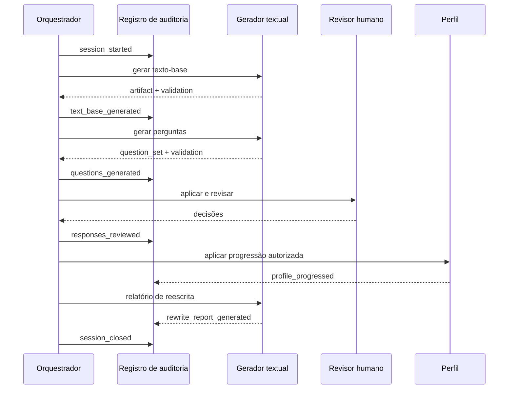
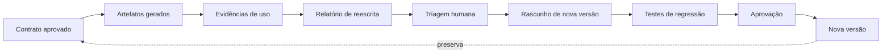

# 06 — Auditoria, reescrita e reparo JSON

## Objetivo

Documentar a trilha administrativa existente, o ciclo de melhoria dos contratos e a recuperação controlada de saídas inválidas.

## Administração atual

`QuizAdminRuntime` mantém:

- `session_id` aleatório;
- sequência de etapas;
- perfil inicial;
- perfil progredido;
- eventos de progressão.

O agente administrativo é instruído a apenas chamar `register_step` e finalizar com confirmação. Falha administrativa é capturada e registrada como aviso; o fluxo pedagógico pode continuar. No OKF, essa falha deve aparecer de forma estruturada para evitar auditoria aparentemente completa.

## Eventos atuais

O fluxo terminal registra:

1. `iniciar_sessao`;
2. `texto_base_gerado`;
3. `perguntas_geradas`;
4. `perfil_progredido`;
5. `respostas_coletadas`;
6. `encerrar_sessao`.

## Contrato conceitual de evento

```text
AuditEvent
  event_id
  session_id
  sequence
  event_type
  occurred_at
  recorded_at
  actor
    actor_type: human | service | model_agent
    actor_role
    actor_ref?
  subject_refs[]
  contract_refs[]
  payload
  visibility
  integrity
    previous_event_hash?
    event_hash
  status
  error?
```

O `payload` deve ser mínimo. Respostas integrais, observações privadas e prompts não precisam ser duplicados em cada evento; o evento aponta para documentos autorizados.

## Sequência auditável



## Artefatos atuais

`save_outputs!` prevê:

- texto-base JSON;
- resultados JSON com contexto completo;
- relatório local de avaliação;
- relatório textual de reescrita.

O payload de resultados inclui:

- sessão administrativa;
- habilidade;
- perfil inicial e atualizado;
- todas as compreensões;
- todas as instruções;
- texto-base;
- quiz;
- respostas;
- resumo;
- relatório de reescrita.

Esse artefato é útil para reprodução, mas mistura dados com diferentes sensibilidades. O OKF deve separá-lo em documentos referenciados e projeções, evitando um único arquivo com acesso irrestrito.

## Relatório local de avaliação

O relatório atual agrega:

- total de perguntas;
- respostas com evidência suficiente;
- taxa de sustentação textual;
- resultado por operação cognitiva;
- pergunta, resposta, referência, rubrica e observação humana por item.

Esse relatório é privado. Uma projeção para estudante deve conter feedback e progresso autorizado, não a íntegra da resposta de referência, rubrica interna ou notas de revisão.

## Relatório de reescrita

O contrato atual exige dez seções:

1. diagnóstico do contexto BNCC;
2. diagnóstico da compreensão de texto-base;
3. qualidade do texto-base;
4. qualidade da compreensão-base;
5. diagnóstico do tópico das perguntas;
6. qualidade das perguntas;
7. evidências das respostas;
8. separação entre dificuldade do aluno, falha da pergunta e falha do texto;
9. recomendações para as compreensões;
10. versão reescrita sugerida.

## Contrato de reescrita

```text
RewriteReport
  report_id
  target_contract_refs[]
  source_artifact_refs[]
  evidence_summary_ref
  diagnostics[]
    layer
    status
    observed_issue
    evidence_refs[]
    severity
  attribution
    learner_difficulty[]
    question_issue[]
    text_base_issue[]
    contract_issue[]
    inconclusive[]
  recommendations[]
    target_ref
    change_type
    proposed_change
    rationale
    expected_effect
  proposed_revisions[]
  limitations[]
  review_status
```

O relatório pode propor nova redação, mas não deve substituir automaticamente uma compreensão aprovada.

## Ciclo de melhoria



## Reparo JSON atual

`FrameworkLlamaTextInference#json`:

1. chama o modelo;
2. tenta extrair e parsear o objeto JSON;
3. em falha, envia prompt de recuperação com erro, prompt original e resposta quebrada;
4. pede JSON válido, sem Markdown, com strings escapadas e estruturas fechadas;
5. tenta parsear novamente.

## Riscos do reparo

- completar conteúdo truncado pode introduzir texto não presente na primeira resposta;
- o reparo pode satisfazer sintaxe e violar invariantes;
- enviar novamente o prompt e a resposta aumenta exposição de dados;
- resposta quebrada pode conter instrução adversarial;
- uma segunda resposta não é equivalente bit a bit à primeira.

## Contrato de reparo proposto

```text
RepairAttempt
  repair_id
  original_execution_ref
  broken_output_hash
  parser_error_code
  repair_strategy
  attempt_number
  repaired_output_ref?
  validation_results[]
  semantic_diff_summary
  status: repaired | failed | rejected
  created_at
```

### Política

- no máximo uma tentativa automática por execução no v0.1;
- preservar hash da resposta quebrada;
- nunca sobrescrever o artefato original;
- marcar o artefato reparado;
- executar novamente todas as validações;
- comparar campos críticos;
- exigir revisão humana se o reparo completou conteúdo, não apenas delimitadores;
- falhar de forma segura após nova falha.

### Reparos determinísticos preferíveis

Antes de nova chamada ao modelo, o sistema pode aplicar somente transformações seguras e registradas:

- remover fence Markdown externo;
- localizar o primeiro `{` e o último `}` quando ambos existem;
- normalizar BOM e caracteres de controle inválidos.

Não deve inventar chave, fechar conteúdo semanticamente incompleto ou adivinhar enum de forma determinística.

## Validação pós-reparo

| Validação | Obrigatória |
| --- | --- |
| parse JSON | sim |
| JSON Schema | sim |
| referências e hashes | sim |
| quantidade de itens | sim |
| invariantes pedagógicos | sim |
| scanner de segredo e PII | sim |
| comparação de campos críticos | sim |
| revisão humana em conteúdo completado | sim |

## Integridade de auditoria

Eventos podem formar encadeamento de hashes. Isso detecta alteração, mas não substitui controle de acesso ou backup.

Recomenda-se registrar:

- relógio em UTC;
- sequência monotônica por sessão;
- hash do evento anterior;
- ID idempotente;
- versão do schema;
- identidade de serviço;
- motivo de correção posterior.

Eventos não devem ser apagados silenciosamente. Correções são novos eventos que referenciam o anterior.

## Falhas administrativas

Quando o administrador atual falha, `run_admin_step!` apenas emite aviso. No v0.1:

```text
audit_status:
  complete
  partial
  unavailable
```

Uma sessão com auditoria parcial pode continuar apenas conforme política, mas não pode ser apresentada como completamente rastreada.

## Observabilidade

Métricas operacionais permitidas:

- taxa de JSON inválido;
- taxa de reparo e rejeição;
- latência por etapa;
- falhas de retrieval;
- artefatos bloqueados por schema;
- divergência entre análise e revisão humana;
- sessões com auditoria parcial;
- contratos com maior incidência de reescrita.

Logs não devem conter prompt, resposta do estudante ou texto integral por padrão.

## Retenção

| Documento | Retenção sugerida no v0.1 |
| --- | --- |
| fonte e contrato aprovado | enquanto ativo e histórico de substituição |
| artefato pedagógico publicado | enquanto referenciado, depois arquivo |
| execução de geração | janela operacional definida |
| resposta identificável | mínimo necessário para finalidade educacional |
| evento administrativo | conforme política institucional e obrigação aplicável |
| saída quebrada | curta, restrita e somente para diagnóstico |
| relatório agregado anonimizado | conforme governança pedagógica |

Valores concretos devem ser aprovados pela governança; não são definidos pelo código atual.

## Runbook de incidente de geração

1. suspender publicação do artefato afetado;
2. registrar evento `generation_incident_opened`;
3. preservar hashes, versões e referências, sem ampliar acesso ao conteúdo;
4. classificar falha: fonte, retrieval, contrato, modelo, parser, projeção ou revisão;
5. identificar artefatos e cursos dependentes;
6. corrigir em nova versão;
7. executar testes de regressão;
8. obter aprovação pedagógica e de segurança quando aplicável;
9. publicar nova projeção;
10. registrar substituição e encerrar incidente.
