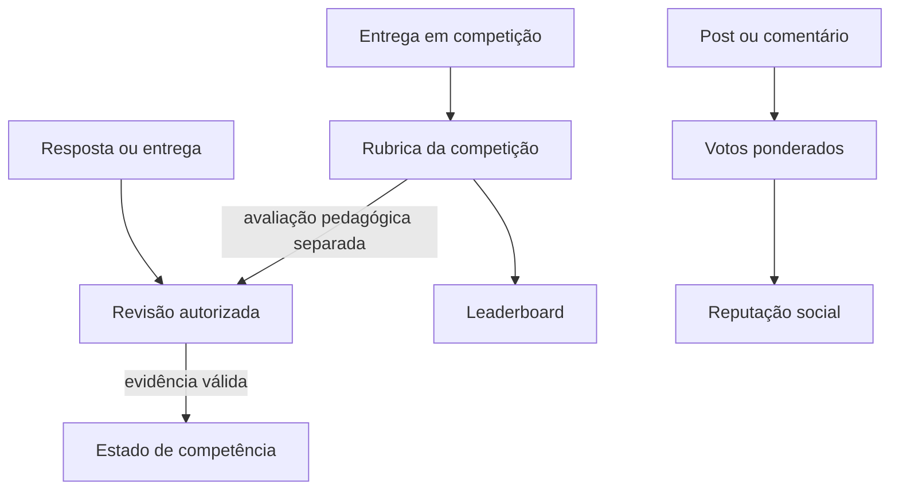

# 07 — Projeções e visibilidade

## Objetivo

Definir como um documento OKF canônico produz representações menores para site público, estudante, professor, escola, plataforma e auditoria.

## Por que projetar

O payload atual de `save_outputs!` reúne contexto, prompts, perfil, respostas e relatórios. Publicar esse payload diretamente violaria minimização e separação de papéis.

Uma projeção:

- usa allowlist de campos;
- remove dados desnecessários;
- pode resumir proveniência;
- preserva referência e versão;
- nunca altera o documento canônico;
- é regenerável e validável.

## Papéis da plataforma

Derivados de `PLATAFORMA.md`:

- visitante público;
- estudante;
- professor aprovado;
- administração escolar;
- administração da plataforma.

O perfil adiciona dois atores técnicos:

- serviço interno de geração/análise;
- auditor autorizado.

## Matriz de visibilidade por papel

Legenda: **L** leitura, **E** edição/autoria, **A** aprovação, **—** sem acesso.

| Recurso | Público | Estudante | Professor | Escola | Plataforma | Auditor | Serviço |
| --- | ---: | ---: | ---: | ---: | ---: | ---: | ---: |
| Catálogo de cursos aprovado | L | L | L | L | E/A | L | L |
| Resumo da habilidade BNCC | L | L | L | L | E/A | L | L |
| Fonte e página aprovadas | L | L | L | L | E/A | L | L |
| Compreensões completas | — | — | E/L | L | E/A | L | L |
| Instruções de prompt | — | — | — | — | E/A | L | L |
| Texto-base aprovado | L quando público | L | E/L | L | E/A | L | L |
| Compreensão-base analítica | — | — | L | L agregada | E/A | L | L |
| Pergunta ativa | — | L na tentativa | E/L | L conforme turma | E/A | L | L |
| Resposta de referência | — | após política de feedback | L | L restrita | E/A | L | L |
| Resposta do estudante | — | própria | L autorizado | L restrita | L excepcional | L autorizado | processamento mínimo |
| Análise candidata | — | feedback projetado | L/revisar | agregado | L/A | L | E |
| Observação humana | — | resumo autorizado | E/L | L restrita | L excepcional | L | — |
| Perfil pedagógico | — | próprio | L autorizado | agregado/necessário | L excepcional | L autorizado | processamento mínimo |
| Reputação social | resumo público conforme privacidade | própria | L | agregado | moderação | conforme auditoria | — |
| Eventos de auditoria | — | — | próprios quando necessário | L restrita | L/A | L | E |
| Saída quebrada/reparo | — | — | — | — | L restrita | L | E |
| Credenciais e segredos | — | — | — | — | — | — | runtime seguro apenas |

Essa matriz é ponto inicial. Autorizações reais devem considerar instituição, turma, vínculo, consentimento e finalidade.

## Classes de visibilidade

```text
public
authenticated
student_self
teacher_assigned
school_aggregate
platform_restricted
audit_restricted
service_internal
```

Um documento pode ter mais de uma projeção, mas cada projeção possui uma única finalidade declarada.

## Projeção pública

Pode conter:

- título e descrição de curso;
- área, etapa e público;
- resumo da competência;
- fonte oficial e referência;
- material aprovado para divulgação;
- metodologia em linguagem acessível;
- data e versão editorial;
- informações de acessibilidade.

Não contém:

- respostas;
- perfil individual;
- observações;
- compreensão-base interna;
- prompt;
- modelo e parâmetros detalhados quando isso ampliar risco operacional;
- eventos internos;
- conteúdo editorial real em revisão. Fixtures sintéticas ou reconstruídas podem aparecer em ambiente demonstrativo público somente com rótulo inequívoco de `preview`/`legacy-needs-review`, sem dado real e sem alegação de aprovação.

## Projeção do estudante

Pode conter:

- texto-base aprovado;
- pergunta da tentativa;
- comando e recursos de acessibilidade;
- resposta enviada;
- feedback aprovado;
- competência, nível e próximo passo;
- fonte e contexto adequados;
- histórico próprio conforme política.

Não contém:

- rubrica completa antes da resposta quando isso invalida a sondagem;
- observação privada do professor;
- respostas de colegas;
- instruções do modelo;
- análise candidata não revisada.

## Projeção docente

Pode conter, com vínculo autorizado:

- habilidade e fontes;
- compreensões pedagógicas;
- texto-base e análise estruturada;
- perguntas e rubricas;
- resposta do estudante;
- análise candidata;
- evidências citadas;
- decisão humana e histórico;
- sugestões de mediação;
- relatório de reescrita pertinente.

O professor não precisa receber segredos de infraestrutura, prompts administrativos completos ou respostas de estudantes fora do seu vínculo.

## Projeção escolar

Prioriza agregados:

- adesão e conclusão;
- habilidades trabalhadas;
- distribuição de estados por turma;
- necessidade de mediação agregada;
- acessibilidade e cobertura curricular;
- qualidade dos materiais;
- auditoria de professor conforme autorização.

Não deve expor ranking sensível ou comparação pública de menores.

## Projeção da plataforma

Destina-se a:

- gestão de contratos e versões;
- moderação;
- incidentes;
- aprovação editorial;
- qualidade e segurança;
- auditoria de serviços.

Acesso deve ser just-in-time, registrado e limitado por função. “Administração da plataforma” não significa acesso irrestrito por padrão.

## Projeção de auditoria

Contém:

- IDs e versões;
- proveniência;
- validações;
- eventos;
- decisões humanas;
- hashes;
- incidentes;
- campos privados apenas quando indispensáveis e autorizados.

Não contém chain-of-thought. Auditoria usa evidências, regras e decisões registradas.

## Separação entre domínios

`PLATAFORMA.md` define três domínios independentes:

| Domínio | Origem | Não deve afetar |
| --- | --- | --- |
| Competência | quizzes e evidências | reputação e placar |
| Reputação social | votos em contribuições | competência |
| Competição | rubricas e critérios do desafio | competência diretamente |

Uma entrega de competição pode gerar evidência se passar por avaliação explicitamente vinculada à competência. O placar em si não gera domínio.



## Contrato de projeção

```text
ProjectionDefinition
  projection_id
  projection_version
  source_document_type
  audience
  purpose
  allowed_fields[]
  transforms[]
  redactions[]
  conditional_rules[]
  cache_policy
  review_policy
```

```text
ProjectionInstance
  projection_instance_id
  definition_ref
  source_ref
  source_version
  generated_at
  expires_at?
  payload
  validation_results[]
```

## Redação e pseudonimização

Transformações permitidas:

- substituir identificador direto por ID opaco;
- remover nome, e-mail e turma quando não necessários;
- truncar trecho ofensivo preservando sentido pedagógico;
- agregar métricas acima de limiar mínimo;
- generalizar timestamp quando precisão não é necessária;
- remover prompts, observações e infraestrutura.

Pseudonimização não torna dado automaticamente anônimo. O vínculo reversível continua protegido.

## Regras condicionais

Exemplos:

- resposta de referência só aparece após envio e conforme política do curso;
- professor só acessa estudante com vínculo ativo;
- escola vê agregado quando o grupo atende limiar de privacidade;
- material editorial real em `review` não aparece na projeção pública de produção; fixture sintética de demonstração pode ser exportada com status e aviso visíveis, sem integrar catálogo aprovado;
- artefato depreciado permanece em tentativa iniciada, mas não inicia nova tentativa;
- incidente aberto pode retirar projeção sem apagar o documento canônico.

## Validação de projeção

1. resolver documento e versão;
2. validar status permitido;
3. aplicar allowlist;
4. aplicar redações;
5. executar regras condicionais;
6. verificar segredo e PII;
7. verificar conteúdo inadequado ao público;
8. assinar ou hashear a projeção;
9. registrar evento de publicação;

## Cache e revogação

Projeções públicas podem ser cacheadas, mas precisam de:

- chave por ID e versão;
- invalidação em incidente;
- manifesto de versão;
- ausência de dado privado;
- política para conteúdo depreciado.

Projeções privadas não devem ser armazenadas em cache público, service worker compartilhado ou artefato do GitHub Pages.

## Testes de autorização

- visitante não acessa pergunta ativa nem resposta;
- estudante A não acessa resposta de B;
- professor sem vínculo não acessa turma;
- administração escolar recebe agregado esperado;
- projeção pública não contém chaves internas;
- alteração de status remove material de nova tentativa;
- evento de auditoria registra publicação e revogação;
- campos desconhecidos não passam automaticamente pela projeção.
