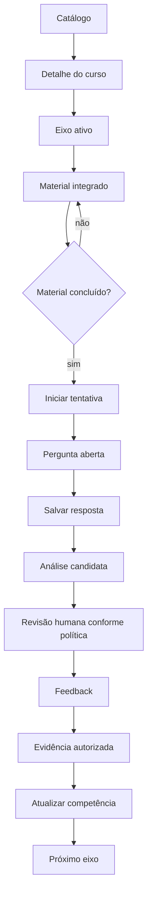
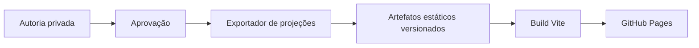
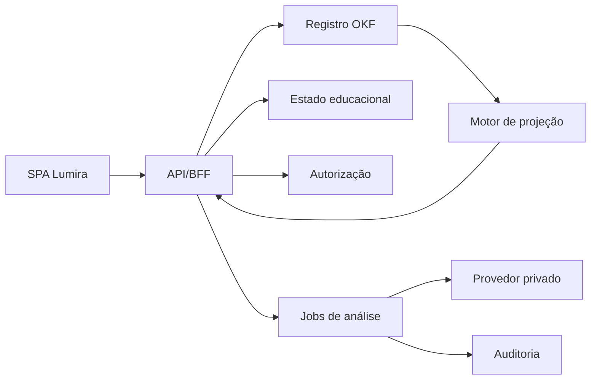

# 08 — Integração com cursos e APIs futuras

## Objetivo

Definir como documentos OKF v0.1 reconstruídos alimentam os fluxos de curso da Lumira sem acoplar o site ao motor local de geração.

## Estado atual da interface

A SPA possui rotas por hash. `src/main.js` coordena os estados do curso e `src/okf-client.js` resolve o manifesto JSON, o curso e os artefatos referenciados, com erro explícito e nova tentativa.

O curso demonstrativo carregado do OKF contém:

- título e área;
- série e percentual;
- ciclo atual;
- chamada para continuar;
- lista de eixos;
- status de conclusão.

O eixo do curso já apresenta material e atividade aberta vindos da projeção OKF, além de pré-análise local sem IA. O quiz avulso continua estático. Já existem serializador Ruby, schemas, validador e leitura JSON; API autenticada, persistência de tentativa e análise real continuam ausentes.

## Fluxo de curso definido pela plataforma

`PLATAFORMA.md` define:

```text
curso
  → ciclos
  → eixos
  → material integrado
  → quiz
  → evidência
  → progressão
```

Cada eixo deve ser página contínua de texto, caso, lacuna, validação ou refutação e continuação.

## Modelo histórico aproveitável

`40e135d:src/ui.ts` usava:

```text
PortalTrack
  id
  title
  area
  competency
  stageBucket
  audience
  summary
  mentor
  weeklyChallenge
  color
  students
  completionRate
  skillTags[]
  levels[]

TrackLevel
  id
  title
  summary
  mastery
  badge
  xpReward
  materialIds[]

PortalMaterial
  id
  trackId
  levelId
  title
  competency
  kind
  format
  duration
  summary
  progress
  status
  xp
  tags[]
  path?
```

O v0.1 reaproveita a relação, mas separa definição pedagógica de estado individual. Campos como `progress`, `status` e `completionRate` não devem ficar no documento canônico do material.

## Modelo OKF implementado inicialmente para curso

```text
CourseDefinition
  course_id
  version
  title
  summary
  area
  stage
  audience
  competency_refs[]
  skill_refs[]
  source_refs[]
  cycles[]
    cycle_id
    title
    purpose
    axis_refs[]
  publication_status
  accessibility
  visibility
```

```text
CourseAxis
  axis_id
  version
  course_ref
  cycle_ref
  title
  purpose
  skill_refs[]
  expected_evidence[]
  material_refs[]
  question_set_refs[]
  prerequisites[]
  next_axis_ref?
```

```text
CourseMaterial
  material_id
  version
  axis_ref
  material_type
  title
  summary
  duration
  content_artifact_ref
  source_refs[]
  tags[]
  accessibility
  review_status
```

```text
LearnerCourseState
  learner_ref
  course_ref
  active_axis_ref
  completed_material_refs[]
  attempts[]
  evidence_refs[]
  competency_state_refs[]
  updated_at
```

## Mapeamento de artefatos para telas

| Tela/rota | Documento principal | Projeção |
| --- | --- | --- |
| `/cursos` | catálogo de `CourseDefinition` | pública ou autenticada |
| `/cursos/{course}` | `CourseDefinition` + estado | estudante |
| `/cursos/{course}/eixos/{axis}` | `CourseAxis` + materiais | estudante |
| material integrado | `TextBaseArtifact` aprovado | estudante |
| `/quizzes/{id}` | `QuestionSet` + tentativa | estudante |
| feedback | `HumanReviewDecision` projetada | estudante |
| painel de turma | análises e evidências agregadas | professor/escola |
| autoria | contrato, fontes, artefatos e validação | privado |

## Material integrado

Uma projeção de texto-base para estudante deve transformar:

- `structure.opening` em introdução;
- `central_content.paragraphs` e `speeches` em conteúdo principal acessível;
- `closing` em fechamento;
- fonte e habilidade em contexto curricular resumido.

Não deve expor:

- abstrações narrativas de autoria;
- compreensão-base analítica;
- erro provável;
- operações de avaliação;
- evidências esperadas antes da atividade, quando isso compromete a sondagem;
- instruções de geração.

## Fluxo de estudo



## Estados da tentativa

```text
created
started
in_progress
submitted
analysis_pending
review_pending
reviewed
feedback_available
completed
cancelled
expired
```

Uma tentativa fixa as versões de curso, eixo, texto-base, perguntas e rubrica. Atualização editorial não pode alterar uma tentativa já iniciada.

## Arquitetura estática implementada no demonstrativo

No GitHub Pages, somente conteúdo aprovado e não privado pode ser pré-compilado:



Esse modo serve para catálogo, curso demonstrativo e material público. Resposta, análise, perfil e progressão reais exigem backend autenticado.

## Arquitetura dinâmica futura



O navegador nunca recebe chave do modelo. A API valida papel, vínculo e finalidade antes de projetar dados.

## API de leitura futura

### Catálogo

```text
GET /api/v1/courses?area=&stage=&status=published
```

Retorna coleção paginada de projeções permitidas.

### Curso

```text
GET /api/v1/courses/{course_id}
ETag: hash da projeção
```

Pode incluir estado individual somente em sessão autenticada.

### Eixo

```text
GET /api/v1/courses/{course_id}/axes/{axis_id}
```

Retorna eixo, materiais disponíveis, pré-requisitos e próximo passo.

### Material

```text
GET /api/v1/materials/{material_id}
```

Retorna projeção adequada; campos internos são removidos no servidor.

## API de tentativa futura

### Criar tentativa

```text
POST /api/v1/question-sets/{question_set_id}/attempts
Idempotency-Key: obrigatório
```

Resposta:

```text
201 Created
attempt_id
fixed_versions
first_question_projection
expires_at?
```

### Salvar resposta

```text
PUT /api/v1/attempts/{attempt_id}/responses/{question_id}
If-Match: versão atual da resposta
Idempotency-Key: obrigatório
```

### Enviar tentativa

```text
POST /api/v1/attempts/{attempt_id}/submit
```

Após envio, respostas ficam imutáveis; correção é nova revisão auditada.

### Consultar feedback

```text
GET /api/v1/attempts/{attempt_id}/feedback
```

Retorna `202` enquanto análise ou revisão está pendente e projeção de feedback quando disponível.

## API privada de autoria

```text
POST /api/v1/authoring/generations
GET  /api/v1/authoring/generations/{id}
POST /api/v1/authoring/artifacts/{id}/reviews
POST /api/v1/authoring/artifacts/{id}/publish
POST /api/v1/authoring/artifacts/{id}/deprecate
```

Esses endpoints não fazem parte do bundle público e exigem papéis privilegiados.

## Envelope de resposta

```text
ApiResponse
  data
  meta
    request_id
    schema_version
    projection_version
  links?
```

## Envelope de erro

```text
ApiError
  error
    code
    message
    request_id
    retryable
    field_errors[]?
```

Códigos iniciais:

| Código | HTTP | Uso |
| --- | ---: | --- |
| `not_authenticated` | 401 | sessão ausente |
| `not_authorized` | 403 | papel ou vínculo insuficiente |
| `not_found` | 404 | recurso não visível ou inexistente |
| `version_conflict` | 409 | ETag ou tentativa incompatível |
| `validation_failed` | 422 | corpo ou invariante inválido |
| `analysis_pending` | 202 | processamento assíncrono |
| `rate_limited` | 429 | limite de requisições |
| `generation_unavailable` | 503 | motor privado indisponível |

Mensagens públicas não devem revelar existência de recurso privado.

## Autenticação e autorização

- cookie seguro ou token de curta duração;
- autorização no servidor por recurso e vínculo;
- proteção CSRF quando aplicável;
- escopos separados para autoria, revisão e publicação;
- sessão de estudante não chama endpoints administrativos;
- serviço de análise usa identidade própria e acesso mínimo.

## Idempotência e concorrência

- criação e submissão usam `Idempotency-Key`;
- edição usa `ETag`/`If-Match` ou versão equivalente;
- duplicata não cria duas evidências;
- revisão concorrente exige resolução explícita;
- evento de progressão referencia decisão única.

## Experiência de carregamento e falha

As telas devem distinguir:

- carregando;
- vazio legítimo;
- bloqueado por pré-requisito;
- indisponível temporariamente;
- aguardando análise;
- aguardando professor;
- feedback pronto;
- conteúdo retirado por revisão.

Não usar mensagem de erro genérica para todos os estados. Não mostrar sucesso antes de confirmação do servidor.

## Acessibilidade

Projeções de curso devem incluir:

- idioma;
- estrutura de títulos;
- texto alternativo quando necessário;
- descrição de mídia;
- duração estimada;
- preferências de leitura autorizadas;
- navegação por teclado;
- feedback não dependente apenas de cor;
- preservação do conteúdo avaliado ao adaptar apresentação.

## Eventos de integração

```text
course_opened
axis_opened
material_started
material_completed
attempt_started
response_saved
attempt_submitted
analysis_completed
human_review_completed
feedback_viewed
evidence_applied
axis_completed
```

Eventos analíticos devem usar IDs pseudônimos e não carregar resposta textual.

## Contrato de busca

O campo de busca atual é apenas visual. Uma busca futura deve indexar projeções permitidas, não documentos privados. Resultado público pode combinar:

- curso;
- área;
- competência;
- material publicado;
- comunidade pública moderada.

Busca não deve retornar resposta, observação, prompt ou perfil privado.

## Checklist de integração por tela

- [ ] Documento e projeção possuem versão.
- [ ] Estado de carregamento está definido.
- [ ] Papel é validado no servidor.
- [ ] Campos internos não chegam ao cliente.
- [ ] Tentativa fixa hashes das dependências.
- [ ] Resposta é salva com idempotência.
- [ ] Feedback só usa decisão autorizada.
- [ ] Progressão fica separada de reputação e placar.
- [ ] Eventos não carregam texto sensível.
- [ ] Fluxo funciona sem motor de geração no navegador.
