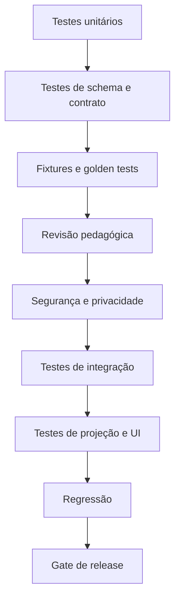
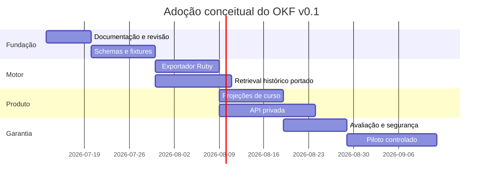

# 10 — Versionamento, testes e migração

## Objetivo

Definir como o OKF v0.1 reconstruído evolui com compatibilidade, testes, aprovação e migração verificável dos remanescentes do projeto.

## Ponto de partida

Há três fontes de continuidade:

1. base OKF local legada, relatada pelo projeto, mas não versionada e não recuperável;
2. projeto TypeScript do commit `40e135d`;
3. motor Ruby e aplicação web atuais.

O v0.1 não tenta reproduzir campos desconhecidos da base local. Ele registra essa lacuna e padroniza o que pode ser demonstrado pelos remanescentes.

## Dimensões de versão

| Dimensão | Exemplo | Quando muda |
| --- | --- | --- |
| Perfil OKF | `0.1` | mudança no envelope ou regras globais |
| Schema | `text-base@2.0.0` | campos, tipos ou invariantes estruturais |
| Documento | `skill:ef69lp01@1.3.0` | conteúdo curado |
| Contrato | `contract:questions:ef69lp01@2.1.0` | contexto/instrução/invariante |
| Ranking | `vectorless-ranking@1.0.0` | tokenizer, fórmula, pesos ou limites |
| Projeção | `student-question@1.0.0` | allowlist ou transformação |
| Escala | `lumira-platform@1.0.0` | níveis ou critérios |
| Curso | `leitura-critica@1.0.0` | composição editorial |
| Modelo/política | ID próprio | provedor, modelo, parâmetros ou uso permitido |

## Regras semânticas

Para documentos e schemas:

- **MAJOR**: mudança incompatível, remoção, nova semântica ou novo requisito obrigatório;
- **MINOR**: campo opcional, nova capacidade compatível ou ampliação revisada;
- **PATCH**: correção editorial sem mudança de significado.

O perfil global começa em `0.1` enquanto contratos executáveis e interoperabilidade ainda estão em estabilização.

## Identidade imutável

`document_id` identifica a linhagem. `document_version` identifica uma revisão. Uma versão publicada não é editada no lugar.

```text
DocumentRevision
  document_id
  document_version
  replaces?
  compatible_with[]
  change_type
  change_summary
  content_hash
  dependency_lock
  status
```

## Hashes e canonicalização

O hash deve ser calculado sobre representação canônica definida pela implementação futura:

- UTF-8;
- normalização de quebra de linha;
- ordenação determinística de chaves;
- exclusão de campos voláteis explicitamente listados;
- preservação da ordem de arrays semanticamente ordenados;
- algoritmo de hash registrado.

Não comparar apenas arquivo formatado, pois espaçamento não deve invalidar conteúdo semântico. Ao mesmo tempo, texto-base exibido deve possuir hash próprio que preserve o texto exato.

## Dependency lock

Todo artefato gerado deve registrar as versões efetivas:

```text
DependencyLock
  source_refs[]
  excerpt_refs[]
  skill_ref
  comprehension_refs[]
  instruction_refs[]
  schema_ref
  model_policy_ref
  generator_version
  ranking_version?
  projection_version?
```

Isso permite reconstruir por que duas gerações com o mesmo tema são diferentes sem armazenar raciocínio interno.

## Compatibilidade

### Leitores

Um leitor v0.1 deve:

- rejeitar versão maior desconhecida;
- tolerar campo opcional desconhecido somente quando a política permitir;
- validar `document_type` contra schema correto;
- não projetar automaticamente campo desconhecido;
- preservar extensão desconhecida ao transportar, se seguro.

### Escritores

Um escritor deve:

- declarar versão do perfil e schema;
- emitir apenas campos conhecidos;
- preservar referências;
- não rebaixar versão incompatível silenciosamente;
- validar antes de persistir.

## Estratégia de testes



## Testes unitários

### Indexação BNCC

- extrai código, área, componente e página;
- preserva UTF-8;
- filtra área e habilidade;
- não cria campo curricular ausente;
- gera Markdown com seções obrigatórias;
- reporta PDF inexistente.

### Retrieval histórico portado

- segmentação por título e parágrafo;
- limite de 2.400 caracteres;
- normalização de acento;
- stopwords;
- BM25 e bônus;
- peso de fonte;
- top-k;
- resultado vazio seguro;
- determinismo.

### Parser de habilidade

- lê todas as seis seções;
- rejeita `recorte_bncc` inválido;
- rejeita compreensão ausente;
- não confunde heading adicional;
- mantém hash por bloco.

### Parser de JSON

- remove fence externo permitido;
- preserva conteúdo interno;
- rejeita objeto incompleto;
- registra reparo;
- não aceita campo de chain-of-thought.

## Testes de schema

Cada tipo deve possuir casos:

- mínimo válido;
- completo válido;
- campo obrigatório ausente;
- tipo incorreto;
- enum desconhecido;
- referência inexistente;
- versão incompatível;
- campo privado em projeção pública;
- hash divergente.

## Fixtures

O primeiro conjunto pode usar EF69LP01 porque já existem:

- recorte BNCC;
- compreensão curada;
- índice de fonte;
- texto-base gerado;
- contrato de perguntas no código.

Fixtures não devem conter resposta real identificável. Devem ser claramente marcadas como sintéticas.

## Golden tests

Golden tests não devem exigir que um modelo gere exatamente a mesma prosa. Eles devem verificar:

- schema;
- invariantes;
- cobertura de campos;
- referências;
- hash do texto fixado;
- ausência de alternativas;
- quantidade;
- presença de rubrica;
- ausência de segredo e dado pessoal.

Para componentes determinísticos, como manifesto, ranking e projeção, a saída pode ser comparada integralmente.

## Testes metamórficos

- mudar apenas formatação do recorte não muda código e fonte;
- remover acento da consulta mantém termos recuperáveis;
- reordenar campos JSON não muda hash semântico;
- mudar texto-base invalida question set vinculado;
- trocar resposta de referência por paráfrase compatível não torna redações alternativas inválidas;
- adicionar campo privado ao canônico não o inclui na projeção pública;
- repetir requisição idempotente não duplica evidência.

## Testes pedagógicos

Uma matriz de casos deve cobrir:

- domínio com citação;
- domínio por paráfrase e pista correta;
- opinião pessoal sem evidência;
- erro conceitual;
- resposta ambígua;
- resposta vazia;
- necessidade de mediação;
- variante linguística;
- adaptação de acessibilidade;
- citação de conteúdo ofensivo sem endosso.

Revisores devem avaliar pergunta, texto, rubrica e análise separadamente.

## Testes de segurança

- prompt injection em fonte;
- prompt injection em resposta;
- HTML e script em conteúdo gerado;
- link perigoso;
- chave ou token em artefato;
- path absoluto de máquina;
- acesso cruzado entre estudantes;
- professor sem vínculo;
- cache privado em resposta pública;
- evento com PII;
- conteúdo reparado publicado sem revisão;
- campo desconhecido vazando por projeção.

## Testes de API

- autenticação e autorização;
- idempotência;
- concorrência com `If-Match`;
- paginação;
- status assíncrono;
- erro sem enumeração de recurso privado;
- rate limit;
- expiração de tentativa;
- imutabilidade após envio;
- rollback de projeção.

## Testes do site

- rota de curso carrega definição correta;
- eixo mantém ordem;
- material mostra somente projeção do estudante;
- texto é idêntico ao hash da tentativa;
- quiz não revela referência antes da hora;
- estados pendentes são claros;
- feedback é acessível por teclado e leitor de tela;
- mobile não perde conteúdo;
- falha de API não simula progresso;
- chat social não encobre conteúdo crítico.

## Migração da base local legada

Como o conteúdo não está disponível:

1. registrar uma nota de proveniência sobre sua existência relatada;
2. não inventar arquivos, campos ou versão;
3. preservar qualquer cópia que venha a ser localizada em quarentena somente leitura;
4. calcular inventário e hashes antes de abrir conteúdo;
5. revisar segredos e dados pessoais;
6. comparar conceitos com o v0.1;
7. importar somente após mapeamento e aprovação;
8. manter `legacy_source` e incertezas registradas.

Uma futura descoberta não deve sobrescrever esta reconstrução automaticamente.

## Migração do commit `40e135d`

### Recuperação seletiva

Arquivos podem ser inspecionados individualmente com:

```text
git show 40e135d:src/chunking.ts
git show 40e135d:src/retrieval.ts
git show 40e135d:src/modules.ts
git show 40e135d:src/sessions.ts
git show 40e135d:src/reference-pipeline.ts
```

Não restaurar a árvore completa sobre `src/`, pois hoje esse diretório contém a SPA Vite.

### Ordem recomendada

1. portar tipos e fontes para pacote privado de ferramentas;
2. portar e testar segmentação/ranking;
3. converter trechos em documentos OKF;
4. converter schemas de módulo e sessão;
5. migrar manifesto de referência;
6. reaproveitar modelo de curso, nível e material;
7. ignorar a interface histórica, preservando-a apenas como referência visual/dados;
8. estender o exportador existente às projeções recuperadas do pipeline TypeScript histórico.

## Migração do motor Ruby atual

### Etapa 1 — separar definições

- manter `habilidades/*.md` como fonte autoral;
- atribuir IDs e versões às cinco compreensões;
- extrair schemas executáveis das instruções;
- registrar contrato composto.

### Etapa 2 — envelopar artefatos

- texto-base → `text_base`;
- perguntas → `question_set`;
- respostas → `student_response` privado;
- resumo → `evidence_summary`;
- perfil → `profile_progression`;
- reescrita → `rewrite_report`;
- etapa administrativa → `audit_event`.

### Etapa 3 — corrigir portabilidade

- remover caminho obrigatório `C:/dev/glauco-framework/gem` do contrato de instalação;
- tornar provider e endpoint configuração de ambiente privado;
- normalizar caminhos de fonte;
- separar fixture de resultado real;
- impedir commit acidental de respostas.

### Etapa 4 — validar exemplo atual

O JSON de texto-base existente deve receber status `legacy_unvalidated` até:

- ser validado contra schema de sua versão original, se identificável;
- ou ser curado/regenerado com o contrato atual.

Não adicionar automaticamente os três campos argumentativos ausentes.

## Fases de adoção



As datas representam planejamento inicial a partir da data do documento, não compromisso de entrega.

## Runbook de atualização de habilidade

1. identificar fonte, edição, página e código;
2. executar ou revisar indexação;
3. criar nova revisão do `skill`;
4. atualizar compreensões aplicáveis;
5. revisar adequação pedagógica;
6. atualizar contratos dependentes;
7. executar testes unitários, schema e fixtures;
8. gerar artefatos candidatos;
9. revisar texto, perguntas e rubricas;
10. aprovar documentos;
11. gerar projeções;
12. publicar nova versão do curso;
13. manter tentativas existentes presas à versão anterior;
14. registrar mudança e depreciação.

## Runbook de atualização de prompt

1. abrir proposta com problema e evidência;
2. identificar bloco de compreensão ou instrução afetado;
3. evitar editar contrato publicado no lugar;
4. criar nova versão e resumo da mudança;
5. atualizar schema se necessário;
6. rodar fixtures positivas, negativas e adversariais;
7. comparar divergência com a versão anterior;
8. obter revisão pedagógica;
9. obter revisão de segurança quando houver dados ou projeção nova;
10. aprovar para geração controlada;
11. monitorar reparo, rejeição e revisão humana;
12. promover ou reverter.

## Runbook de atualização de modelo

1. registrar provider, modelo, parâmetros e política;
2. verificar tratamento de dados e retenção;
3. executar suite congelada de contratos;
4. medir validade estrutural;
5. revisar amostra pedagógica cega;
6. testar segurança e injeção;
7. comparar divergência de análise humana;
8. executar shadow mode sem efeito em perfil;
9. aprovar tarefa por tarefa;
10. habilitar canário;
11. monitorar;
12. ampliar ou acionar kill switch.

## Runbook de publicação no curso

1. selecionar `CourseDefinition` e versão;
2. resolver ciclos, eixos, materiais e question sets;
3. verificar status `approved`;
4. verificar dependências e hashes;
5. gerar projeções pública e educacional;
6. executar scanner de PII, segredo e conteúdo;
7. executar testes de UI e acessibilidade;
8. construir bundle estático apenas com conteúdo público;
9. publicar com manifesto de versão;
10. validar URLs e cache;
11. registrar evento de publicação;
12. manter rollback para projeção anterior.

## Runbook de depreciação

1. marcar documento como `deprecated` com substituto;
2. impedir novas tentativas na versão antiga;
3. preservar tentativas em andamento conforme política;
4. atualizar projeções e catálogo;
5. notificar papéis afetados;
6. monitorar referências residuais;
7. arquivar após janela definida;
8. nunca apagar trilha silenciosamente.

## Rollback

Rollback de projeção não apaga documentos novos. Ele:

- retira ou substitui a projeção;
- restaura versão anterior aprovada;
- registra motivo e responsável;
- preserva tentativas já fixadas;
- abre incidente quando necessário;
- agenda correção em nova versão.

## Gate de release

| Gate | Responsável | Evidência |
| --- | --- | --- |
| fonte | autoria/pedagogia | página, hash e recorte |
| schema | engenharia | testes automatizados |
| qualidade pedagógica | revisor | decisão registrada |
| segurança e privacidade | responsável designado | checklist e testes |
| projeção | engenharia/produto | allowlist e scanner |
| acessibilidade | produto/QA | testes e revisão |
| publicação | editorial | status aprovado |

## Checklist final de versão

- [ ] `okf_version` e schema declarados.
- [ ] IDs e versões são estáveis.
- [ ] Dependency lock está completo.
- [ ] Hashes foram calculados.
- [ ] Fontes resolvem.
- [ ] Invariantes passam.
- [ ] Fixtures e regressão passam.
- [ ] Revisão pedagógica está registrada.
- [ ] Segurança e privacidade foram revisadas.
- [ ] Nenhum chain-of-thought é persistido.
- [ ] Nenhum segredo ou dado real entrou no Git.
- [ ] Projeções foram testadas por papel.
- [ ] Rollback foi preparado.
- [ ] Changelog e depreciações foram atualizados.

## Lacunas conhecidas do v0.1

- conteúdo literal da base OKF local legada indisponível;
- schemas executáveis cobrem a projeção pública inicial, mas ainda não todo o domínio privado;
- o exportador/registro dos prompts Ruby está implementado; falta generalizar para novas habilidades e runtimes;
- retrieval histórico ainda fora da árvore atual;
- apenas uma habilidade possui compreensão curada detalhada;
- perguntas completas não estão commitadas como fixture;
- exemplo de texto-base diverge do contrato atual;
- backend e autorização ainda são futuros;
- política concreta de retenção depende de governança;
- mapeamento entre escalas precisa de aprovação pedagógica;
- suíte de avaliação de modelo ainda precisa ser construída.

Essas lacunas não impedem o consumo estático do curso demonstrativo nem a exportação verificável dos prompts Ruby, mas impedem declarar a plataforma pedagógica completa ou a API OKF operacional.
