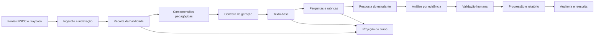

# OKF no Cognoscere

## Status e escopo

Este diretório define a reconstrução e a adoção padronizada do **Open Knowledge Format (OKF) v0.1** no Cognoscere.

Havia uma base OKF legada em pasta local, segundo o contexto operacional do projeto, mas ela não foi versionada neste repositório. Seu conteúdo original não aparece no estado atual, refs, reflog ou objetos recuperáveis pelo histórico Git analisado. Os remanescentes semânticos em `inicio.rb`, `habilidades/`, dados BNCC e no projeto TypeScript histórico permitem reconstruir responsabilidades e contratos, mas não permitem afirmar a estrutura literal daquela base local.

O v0.1 documentado aqui é, portanto, uma **reconstrução verificável e uma nova padronização**, não uma cópia presumida da base indisponível. Antes desta reconstrução, não havia bundle OKF versionado no repositório.

O perfil OKF do Cognoscere organiza conhecimento pedagógico, contratos de prompts, artefatos gerados, evidências, proveniência e projeções de acesso. Ele não substitui a BNCC, não transforma saída de modelo em verdade normativa e não autoriza a publicação de dados privados.

Esta documentação está fora do bundle público da aplicação. Os arquivos em `docs/okf/` são material técnico e de governança; não são carregados pelo site estático.

## Base documental

As regras descritas aqui derivam exclusivamente de duas bases do próprio repositório:

- estado atual, especialmente `inicio.rb`, `scripts/bncc_pdf_index.rb`, `habilidades/`, `data/`, `PLATAFORMA.md` e `src/main.js`;
- projeto TypeScript histórico do commit `40e135d`, especialmente `src/chunking.ts`, `src/retrieval.ts`, `src/qa.ts`, `src/playbooks.ts`, `src/modules.ts`, `src/sessions.ts`, `src/reference-pipeline.ts`, `src/types.ts` e `src/ui.ts`.

O commit `65ee97e` removeu o projeto TypeScript original. O commit `9720dbe` introduziu o motor Ruby/JRuby atual. A documentação mantém essa linhagem explícita para que uma migração não seja confundida com uma implementação já existente.

## O que o OKF registra

O perfil reconstruído v0.1 registra:

- identidade, tipo e versão do documento;
- escopo pedagógico e recorte BNCC;
- fonte, página, trecho e transformação aplicada;
- contexto fornecido ao modelo;
- instruções, invariantes e formato de saída;
- artefatos de texto-base, perguntas, rubricas e análise;
- validações automáticas e decisões humanas;
- eventos administrativos e relatório de reescrita;
- projeção pública, educacional, docente e administrativa;
- política de retenção, segurança e revisão.

## O que o OKF não registra

O OKF não deve armazenar ou expor:

- chain-of-thought, raciocínio interno ou tokens ocultos do modelo;
- chaves de API, tokens, caminhos secretos ou credenciais;
- resposta integral de estudante em projeção pública;
- inferência psicológica, diagnóstico clínico ou atributo sensível não necessário;
- conteúdo não rastreável apresentado como regra da BNCC;
- logs brutos sem política de acesso e retenção.

Para explicar uma decisão, o sistema registra critérios observáveis, evidências citadas, regra aplicada, resultado e intervenção humana. Isso é suficiente para auditoria sem revelar raciocínio interno.

## Perfil conceitual v0.1

Todo documento OKF do Cognoscere segue este envelope conceitual:

```text
OKFDocument
  okf_version
  document_id
  document_type
  document_version
  status
  title
  scope
  provenance
  contract
  payload
  validation
  visibility
  lifecycle
```

Os campos representam:

| Campo | Finalidade |
| --- | --- |
| `okf_version` | Versão do perfil, inicialmente `0.1` |
| `document_id` | Identificador estável e não semântico |
| `document_type` | Tipo controlado, como `skill`, `text_base`, `question_set`, `response_analysis` |
| `document_version` | Revisão do conteúdo ou contrato |
| `status` | `draft`, `review`, `approved`, `deprecated` ou `archived` |
| `scope` | Etapa, série, área, componente, habilidade e público |
| `provenance` | Fontes, páginas, hashes, modelo e transformações |
| `contract` | Contextos, instruções, invariantes, schema e política de validação |
| `payload` | Conteúdo correspondente ao tipo de documento |
| `validation` | Resultado das verificações automáticas e humanas |
| `visibility` | Projeções e papéis autorizados |
| `lifecycle` | Criação, revisão, aprovação, substituição e retenção |

Esse envelope representa o contrato completo do domínio e continua parcialmente proposto. A implementação atual já serializa o registro técnico em `okf/`, a projeção pública em `public/okf/` e valida ambos com `scripts/validate-okf.mjs`; tipos privados e a API protegida ainda não possuem serialização completa.

## Tipos documentais iniciais

| Tipo | Origem no repositório | Uso |
| --- | --- | --- |
| `source` | `sources.ts` histórico e PDF atual | Fonte normativa ou operacional |
| `retrieval_excerpt` | `chunking.ts` e `retrieval.ts` históricos | Trecho selecionado com score e proveniência |
| `skill` | `habilidades/*.md` | Recorte BNCC e compreensões da habilidade |
| `prompt_contract` | constantes e builders de `inicio.rb` | Contrato de geração ou análise |
| `module` | `modules.ts` histórico | Módulo educacional orientado por competência |
| `text_base` | `inicio.rb` e JSON atual | Situação de leitura e compreensão-base |
| `question_set` | `inicio.rb` | Perguntas diagnósticas e rubricas |
| `student_response` | `apply_quiz!` | Resposta e observação humana privada |
| `response_analysis` | contrato novo deste perfil | Análise baseada em evidências observáveis |
| `profile_progression` | `StudentProfileEntity` | Atualização de evidências e reforços |
| `rewrite_report` | `inicio.rb` | Retroalimentação para melhorar contratos |
| `audit_event` | `QuizAdminRuntime` | Evento administrativo do fluxo |
| `course_projection` | `ui.ts` histórico e curso atual | Conteúdo adequado a cada tela e papel |

## Princípios normativos

1. **Fonte antes de geração.** Conteúdo pedagógico deve apontar para o recorte e a fonte que o sustentam.
2. **Compreensão antes de instrução.** O sentido pedagógico é separado do formato da resposta.
3. **Texto fixo antes de perguntas.** A geração das perguntas não pode alterar o texto-base avaliado.
4. **Evidência antes de progressão.** Competência muda por evidência observável, não por reputação social ou placar.
5. **Humano antes de decisão sensível.** A plataforma apoia, mas não substitui validação docente ou contexto local.
6. **Projeção mínima.** Cada papel recebe apenas os campos necessários.
7. **Validação antes de publicação.** JSON válido não é sinônimo de conteúdo pedagógico aprovado.
8. **Versionamento antes de substituição.** Mudanças de prompt, fonte, schema ou nível geram nova revisão rastreável.
9. **Explicação sem chain-of-thought.** Registrar critérios, evidências e regras, nunca raciocínio oculto.
10. **Falha segura.** Ausência de fonte, schema inválido ou conflito de versão impede publicação automática.

## Visão geral do fluxo



## Índice

1. [Arquitetura e linhagem histórica](01-arquitetura-e-linhagem.md)
2. [Fontes e retrieval vectorless](02-fontes-e-retrieval-vectorless.md)
3. [Compreensões e instruções](03-compreensoes-e-instrucoes.md)
4. [Geração de conteúdo pedagógico](04-geracao-de-conteudo.md)
5. [Análise de resposta](05-analise-de-resposta.md)
6. [Auditoria, reescrita e reparo](06-auditoria-reescrita-e-reparo.md)
7. [Projeções e visibilidade](07-projecoes-e-visibilidade.md)
8. [Integração com cursos e APIs](08-integracao-com-cursos-e-apis.md)
9. [Segurança, privacidade e governança](09-seguranca-privacidade-e-governanca.md)
10. [Versionamento, testes e migração](10-versionamento-testes-e-migracao.md)

## Linguagem normativa

Nesta documentação:

- **DEVE** indica requisito obrigatório;
- **NÃO DEVE** indica proibição;
- **RECOMENDA-SE** indica prática esperada, mas adaptável;
- **PODE** indica opção compatível com o perfil.

## Estado de implementação

| Capacidade | Estado atual |
| --- | --- |
| Extração de habilidades BNCC | Implementada em Ruby |
| Configuração Markdown por habilidade | Implementada para EF69LP01 e scaffold gerável |
| Geração em duas etapas | Implementada no fluxo terminal Ruby |
| Validação humana de evidência | Implementada no fluxo terminal |
| Progressão de perfil | Implementada em memória e artefato local |
| Retrieval vectorless | Existia no commit `40e135d`; não está na árvore atual |
| Geração de módulos e kits | Existia no commit `40e135d`; não está na árvore atual |
| Base OKF local legada | Relatada, não versionada e não recuperável no repositório |
| Exportação dos prompts Ruby | Implementada por `scripts/export_ruby_prompt_okf.rb`; gera `okf/registry.json` e conceitos com hashes |
| Serialização OKF v0.1 reconstruída | Implementada em `okf/` (técnica) e `public/okf/` (projeção pública) |
| API OKF | Proposta, ainda não implementada |
| Projeção OKF no curso web | Implementada em modo estático para `leitura-critica-em-rede`; geração real continua fora do navegador |

## Regra de adoção

A versão v0.1 é aprovada como documentação de referência quando:

- os contratos forem revisados por engenharia e responsável pedagógico;
- exemplos forem anonimizados;
- os schemas executáveis atuais forem revisados e ampliados para os tipos privados;
- os testes atuais de estrutura/build forem complementados por compatibilidade e regressão pedagógica;
- nenhuma projeção pública contiver dados privados ou instruções internas.
