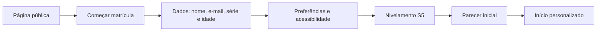
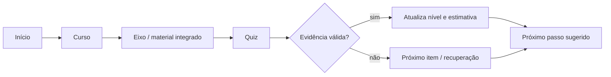
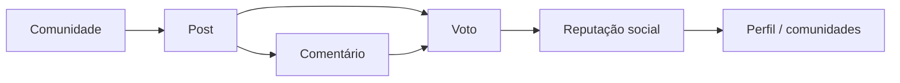
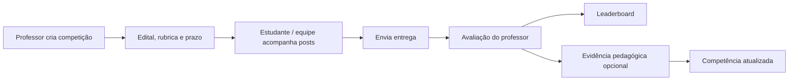
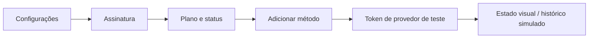

# Lumira — revisão de UX, páginas e fluxos

**Data:** 13 de julho de 2026  
**Escopo:** MVP web atual da Lumira no Cognoscere  
**Método:** revisão UI/UX, conferência de responsividade em desktop (1440 × 1100) e mobile (390 × 844), e análise dos critérios de acessibilidade, navegação, formulários e feedback.

## Resumo executivo

A plataforma apresenta uma identidade visual coerente, com boa leitura, hierarquia clara e uma separação compreensível entre aprendizagem, social e competição. O percurso principal — descoberta, matrícula, quiz, curso e desafio — é visível e tem CTAs claros.

Para a próxima fase, as três prioridades são:

1. Trocar os símbolos tipográficos remanescentes por SVGs de uma única família.
2. Tornar a etapa da matrícula um componente de progresso visual e manter o CTA mais próximo do primeiro bloco de dados no mobile.
3. Em telas de concentração (quiz, entrega e pagamento), recolher ou ocultar a barra social para reduzir distração.

## Mapa de páginas

| Página / rota | Objetivo | Situação da revisão | Evidência |
| --- | --- | --- | --- |
| `/` | Apresentar proposta, diferenciais e matrícula | Aprovada; hero e CTA claros | [captura](../../output/stakeholders/01-publica.png) |
| `/matricula` e `/cadastro` | Coletar dados iniciais | Atenção: CTA fica abaixo da dobra no mobile | [captura mobile](../../output/stakeholders/05-mobile-matricula.png) |
| `/nivelamento` e `/quizzes/hoje` | Diagnosticar e registrar evidência | Aprovada; enunciado, tempo e alternativas são compreensíveis | [captura](../../output/stakeholders/07-quiz.png) |
| `/inicio` | Retomar percurso e orientar próxima ação | Aprovada; boa hierarquia entre estudo, quiz e competição | [captura](../../output/stakeholders/02-inicio.png) |
| `/areas` | Explorar domínio BNCC | Aprovada; grade escaneável e CTA por área | [captura](../../output/stakeholders/10-areas.png) |
| `/cursos/:courseId/eixos/:axisId` | Continuar material integrado | Aprovada; sequência e estado dos eixos claros | [captura](../../output/stakeholders/06-curso.png) |
| `/forum` e páginas de comunidade/post | Descobrir, votar, comentar e publicar | Atenção: ações sociais devem ganhar ícones SVG e estados de moderação | [captura](../../output/stakeholders/03-forum.png) |
| `/escolas/:schoolId/competicoes/:competitionId` | Entender desafio, prazo e ranking | Aprovada; regra de não misturar placar e competência está visível | [captura](../../output/stakeholders/04-competicao.png) |
| `/perfil/:handle` | Comunicar identidade, progresso e reputação | Aprovada; métrica e competências são bem separadas | [captura](../../output/stakeholders/08-perfil.png) |
| `/conta/*` | Gerir perfil, segurança, privacidade e plano | Aprovada para MVP; pagamento de teste está explicitamente sinalizado | [captura](../../output/stakeholders/09-configuracoes.png) |

Rotas de resultado de nivelamento, histórico de quizzes, detalhes de área/escola e tabs de perfil são extensões de suas páginas-mãe; devem reaproveitar o mesmo cabeçalho, navegação e estado ativo.

## Fluxos mapeados

### 1. Descoberta e matrícula

**Ponto de decisão:** o nivelamento não deve exibir pontos internos; o retorno é nível, barra e estimativa percentual.

### 2. Estudo e progressão por competência

**Regra:** reputação e leaderboard nunca alteram diretamente a competência.

### 3. Fórum e reputação

**Controle necessário antes de produção:** moderação, rate limit de votos, denúncia, bloqueio e trilha de auditoria.

### 4. Competição escolar e entrega

**Ponto de decisão:** o leaderboard apresenta desempenho daquele desafio; a evidência avaliada, e não o placar, pode atualizar competência.

### 5. Assinatura e pagamento simulado

**Guardrail:** não coletar ou armazenar PAN/CVV; trocar o modo simulado por adapter de provedor PCI quando a cobrança real entrar no escopo.

## Avaliação por critério

| Critério | Estado | Observação |
| --- | --- | --- |
| Hierarquia e CTA | Bom | Uma ação principal por tela, com contraste adequado. |
| Navegação e deep links | Bom | Rotas por hash suportam GitHub Pages; sidebar e navegação inferior mantêm o acesso às áreas principais. |
| Mobile | Atenção | Matrícula testada em 390 px; a continuação requer rolagem. Validar também quiz, competição e conta em produção. |
| Formulários | Bom no MVP | Labels visíveis, e-mail semântico, autocomplete e erro de matrícula com `role=alert`. Ainda falta loading/disabled para integrações reais. |
| Acessibilidade | Parcial | Skip link, foco e redução de movimento existem. Converter símbolos tipográficos em SVG e completar labels de ícones. |
| Social e moderação | Parcial | O modelo é claro, mas os fluxos de denúncia, bloqueio e moderação ainda são contratos de MVP, não backend implementado. |
| Dados BNCC | Bom em arquitetura | A tela comunica rastreabilidade; a ligação persistente de conteúdo/evidência será responsabilidade da camada de serviços. |

## Recomendações priorizadas

| Prioridade | Ação | Impacto |
| --- | --- | --- |
| P0 | Implementar autenticação, persistência e autorização de papéis antes de abrir o ambiente publicamente | Segurança e integridade pedagógica |
| P0 | Adicionar moderação, denúncia, bloqueio, rate limit e auditoria | Proteção de menores e comunidade |
| P1 | Usar SVGs consistentes no lugar de símbolos tipográficos | Acessibilidade e acabamento multiplataforma |
| P1 | Exibir progresso visual de matrícula e salvar rascunho | Conclusão do funil de onboarding |
| P1 | Recolher social durante quiz/entrega/pagamento | Reduzir carga cognitiva em tarefas críticas |
| P2 | Criar estados de carregamento, vazio, erro e sucesso conectados aos serviços reais | Clareza operacional |
| P2 | Validar contraste e navegação por teclado com dados reais | Conformidade WCAG AA |

## Índice de capturas

Todas as imagens foram geradas a partir do build local em execução; são artefatos do repositório e podem ser usados no alinhamento com stakeholders.

1. [Página pública](../../output/stakeholders/01-publica.png)
2. [Início autenticado](../../output/stakeholders/02-inicio.png)
3. [Fórum](../../output/stakeholders/03-forum.png)
4. [Competição](../../output/stakeholders/04-competicao.png)
5. [Matrícula mobile](../../output/stakeholders/05-mobile-matricula.png)
6. [Curso](../../output/stakeholders/06-curso.png)
7. [Quiz](../../output/stakeholders/07-quiz.png)
8. [Perfil](../../output/stakeholders/08-perfil.png)
9. [Métodos de pagamento](../../output/stakeholders/09-configuracoes.png)
10. [Áreas do conhecimento](../../output/stakeholders/10-areas.png)
