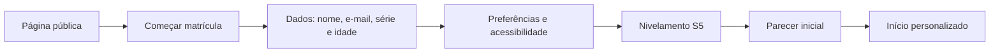
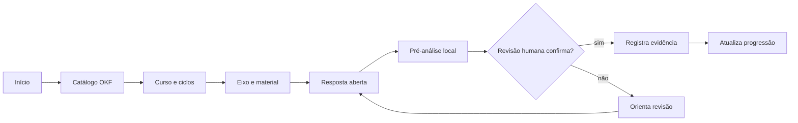
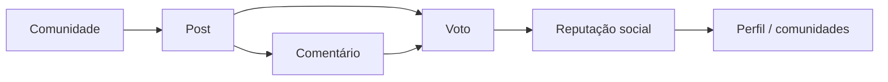
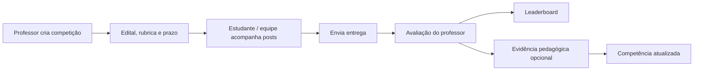
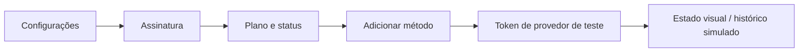
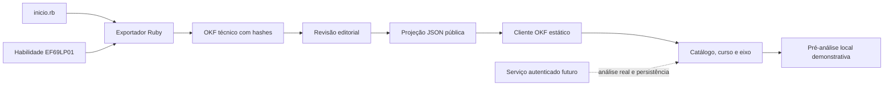
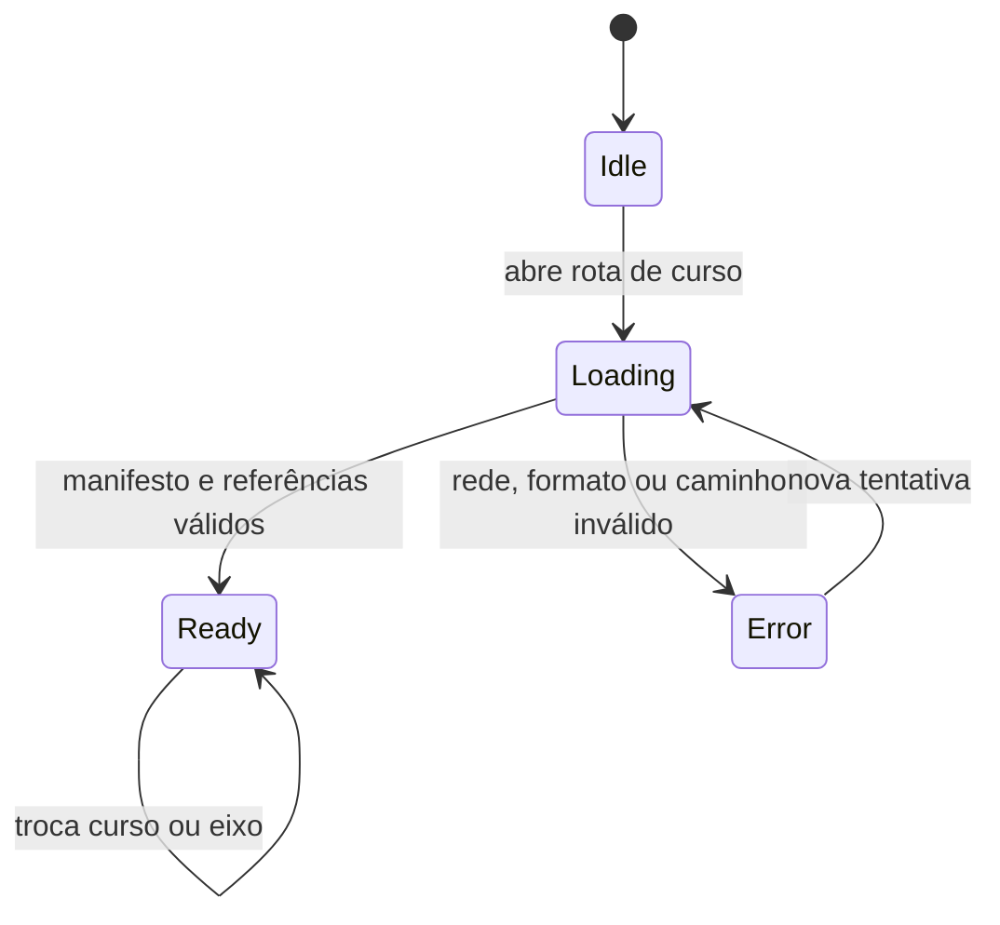

# Lumira — revisão de UX, páginas e fluxos

**Data:** 13 de julho de 2026  
**Escopo:** MVP web atual da Lumira no Cognoscere  
**Método:** revisão UI/UX, conferência de responsividade em desktop (1440 × 1100) e mobile (390 × 844), e análise dos critérios de acessibilidade, navegação, formulários e feedback.

## Resumo executivo

A plataforma apresenta uma identidade visual coerente, com boa leitura, hierarquia clara e uma separação compreensível entre aprendizagem, social e competição. O percurso principal — descoberta, matrícula, quiz, curso e desafio — é visível e tem CTAs claros.

A revisão de direção visual consolidou a plataforma autenticada como um **campus horizontal full-width**: navegação global no topo, conteúdo ocupando toda a largura útil e chat social em sidebar flutuante recolhível. A solução foi conferida em desktop e mobile, preservando a tarefa principal e a presença da comunidade.

O fluxo de cursos agora possui uma integração OKF executável: o catálogo resolve um manifesto público, o curso abre ciclos/eixos, o material apresenta rastreabilidade BNCC e a atividade aberta oferece uma pré-análise local claramente separada da análise pedagógica real. Os templates técnicos continuam no repositório interno e não são enviados ao navegador.

Para a próxima fase, as três prioridades são:

1. Trocar os símbolos tipográficos remanescentes por SVGs de uma única família.
2. Tornar a etapa da matrícula um componente de progresso visual e manter o CTA mais próximo do primeiro bloco de dados no mobile.
3. Em telas de concentração (quiz, entrega e pagamento), recolher ou ocultar a barra social para reduzir distração.

## Mapa de páginas

| Página / rota | Objetivo | Situação da revisão | Evidência |
| --- | --- | --- | --- |
| `/` | Apresentar proposta, diferenciais e matrícula | Aprovada; hero e CTA claros | [captura](../../output/stakeholders/01-publica.png) |
| `/matricula` e `/cadastro` | Coletar dados iniciais | Atenção: CTA fica abaixo da dobra no mobile | [captura mobile](../../output/stakeholders/05-mobile-matricula.png) |
| `/nivelamento` e `/quizzes/hoje` | Diagnosticar e registrar evidência | Aprovada; enunciado, tempo e alternativas são compreensíveis | [captura](../../output/stakeholders/07-quiz.png) |
| `/inicio` | Retomar percurso e orientar próxima ação | Aprovada; conteúdo full-width e chat social flutuante validados em desktop e mobile | [desktop](../../output/stakeholders/11-fullwidth-social-desktop.png) · [mobile](../../output/stakeholders/12-social-mobile.png) |
| `/areas` | Explorar domínio BNCC | Aprovada; grade escaneável e CTA por área | [captura](../../output/stakeholders/10-areas.png) |
| `/cursos` | Descobrir cursos publicados pelo manifesto OKF | Aprovada; versão do contrato, progresso e fronteira público/privado visíveis | [catálogo OKF](../../output/playwright/cognoscere-okf/13-okf-course-catalog.png) |
| `/cursos/:courseId` | Entender percurso, ciclos, eixos e proveniência | Aprovada; fonte curricular, inteligência pedagógica e status editorial legíveis | [visão do curso](../../output/playwright/cognoscere-okf/14-okf-course-overview.png) |
| `/cursos/:courseId/eixos/:axisId` | Ler material, responder atividade e receber orientação inicial | Aprovada para demonstração; conteúdo OKF, atividade aberta e pré-análise local testados | [material](../../output/playwright/cognoscere-okf/15-okf-course-material.png) · [pré-análise](../../output/playwright/cognoscere-okf/16-okf-open-response-analysis.png) · [mobile](../../output/playwright/cognoscere-okf/17-okf-course-mobile.png) |
| `/forum` e páginas de comunidade/post | Descobrir, votar, comentar e publicar | Atenção: ações sociais devem ganhar ícones SVG e estados de moderação | [captura](../../output/stakeholders/03-forum.png) |
| `/escolas/:schoolId/competicoes/:competitionId` | Entender desafio, prazo e ranking | Aprovada; regra de não misturar placar e competência está visível | [captura](../../output/stakeholders/04-competicao.png) |
| `/perfil/:handle` | Comunicar identidade, progresso e reputação | Aprovada; métrica e competências são bem separadas | [captura](../../output/stakeholders/08-perfil.png) |
| `/conta/*` | Gerir perfil, segurança, privacidade e plano | Aprovada para MVP; pagamento de teste está explicitamente sinalizado | [captura](../../output/stakeholders/09-configuracoes.png) |

Rotas de resultado de nivelamento, histórico de quizzes, detalhes de área/escola e tabs de perfil são extensões de suas páginas-mãe; devem reaproveitar o mesmo cabeçalho, navegação e estado ativo.

## Fluxos mapeados

### 1. Descoberta e matrícula

**Ponto de decisão:** o nivelamento não deve exibir pontos internos; o retorno é nível, barra e estimativa percentual.

### 2. Estudo e progressão por competência

**Limite atual:** a demonstração pública termina na pré-análise local; revisão, persistência de evidência e progressão dependem de serviço autenticado. **Regra:** reputação e leaderboard nunca alteram diretamente a competência.

### 3. Fórum e reputação

**Controle necessário antes de produção:** moderação, rate limit de votos, denúncia, bloqueio e trilha de auditoria.

### 4. Competição escolar e entrega

**Ponto de decisão:** o leaderboard apresenta desempenho daquele desafio; a evidência avaliada, e não o placar, pode atualizar competência.

### 5. Assinatura e pagamento simulado

**Guardrail:** não coletar ou armazenar PAN/CVV; trocar o modo simulado por adapter de provedor PCI quando a cobrança real entrar no escopo.

## Avaliação por critério

| Critério | Estado | Observação |
| --- | --- | --- |
| Hierarquia e CTA | Bom | Uma ação principal por tela, com contraste adequado. |
| Navegação e deep links | Bom | Rotas por hash suportam GitHub Pages; navegação horizontal no desktop e inferior no mobile mantêm o acesso às áreas principais. |
| Mobile | Atenção | Curso e chat social validados em 390 px sem rolagem horizontal. Na matrícula, a continuação ainda requer rolagem; validar também quiz, competição e conta em produção. |
| Formulários | Bom no MVP | Labels visíveis, e-mail semântico, autocomplete e erro de matrícula com `role=alert`. Ainda falta loading/disabled para integrações reais. |
| Acessibilidade | Parcial | Skip link, foco e redução de movimento existem. Converter símbolos tipográficos em SVG e completar labels de ícones. |
| Social e moderação | Parcial | O modelo é claro, mas os fluxos de denúncia, bloqueio e moderação ainda são contratos de MVP, não backend implementado. |
| Dados BNCC/OKF | Bom no demonstrativo | Manifesto, curso, material, habilidade e contrato público estão ligados por caminhos verificáveis; a persistência de evidência continua na futura camada de serviços. |

## Recomendações priorizadas

| Prioridade | Ação | Impacto |
| --- | --- | --- |
| P0 | Implementar autenticação, persistência e autorização de papéis antes de abrir o ambiente publicamente | Segurança e integridade pedagógica |
| P0 | Adicionar moderação, denúncia, bloqueio, rate limit e auditoria | Proteção de menores e comunidade |
| P1 | Usar SVGs consistentes no lugar de símbolos tipográficos | Acessibilidade e acabamento multiplataforma |
| P1 | Exibir progresso visual de matrícula e salvar rascunho | Conclusão do funil de onboarding |
| P1 | Recolher social durante quiz/entrega/pagamento | Reduzir carga cognitiva em tarefas críticas |
| P2 | Reaproveitar os estados OKF de carregamento/erro/nova tentativa nos demais serviços reais | Clareza operacional |
| P2 | Validar contraste e navegação por teclado com dados reais | Conformidade WCAG AA |

## Validação da direção full-width e social

- **Desktop (1440 × 1100):** o conteúdo não usa contêiner central limitante; a sidebar social fica fixa à direita, com rolagem própria, acionador na topbar e fechamento explícito.
- **Mobile (390 × 844):** o painel vira uma gaveta flutuante entre a topbar e a navegação inferior, ocupa a largura disponível sem criar rolagem horizontal e mantém controles com pelo menos 44 px.
- **Acessibilidade:** o acionador informa o estado por `aria-expanded`; o painel usa nome acessível e `aria-hidden`; `Esc` fecha primeiro um modal ativo e, na ausência dele, fecha o chat.

[Ver validação desktop](../../output/stakeholders/11-fullwidth-social-desktop.png) · [Ver validação mobile](../../output/stakeholders/12-social-mobile.png)

## Validação do curso OKF e da inteligência de prompts

**Propósito e público:** oferecer a estudantes um curso rastreável e revisável, mantendo templates técnicos, rubricas privadas, respostas de referência e dados pessoais fora da aplicação pública.

### Fronteira implementada

O diagrama representa somente componentes presentes no repositório e o limite operacional atual.

### Carregamento e estados da interface

| Verificação | Resultado em 13/07/2026 |
| --- | --- |
| Catálogo → curso → eixo | Aprovado por navegação real no navegador |
| Manifesto e referências | Carregados de `public/okf/`; nenhum fallback curricular silencioso |
| Resposta aberta | Campo acessível, mínimo comunicado e CTA com 44 px |
| Pré-análise | Rotulada como heurística local; revisão humana explicitamente obrigatória |
| Chat social no desktop | Mantém-se flutuante e o conteúdo reserva espaço quando aberto |
| Chat social no mobile | Vira gaveta entre topbar e navegação inferior |
| Segurança da projeção | Sem prompt administrativo, rubrica privada, resposta real ou credencial |

### Problemas encontrados e corrigidos durante a revisão

1. O chat desktop interceptava o botão “Pré-analisar evidências”; a página passou a reservar a largura da sidebar quando ela está aberta.
2. O caminho da fonte curricular tinha baixo contraste e não quebrava em largura reduzida; recebeu cor explícita e `overflow-wrap`.
3. `OKF v0.1` e o contrato JSON `1.0.0` apareciam como se fossem a mesma versão; o contrato público passou a usar `publicContractVersion` e a interface exibe “Contrato 1.0.0”.
4. O favicon ausente gerava erro 404 no console; foi incluído um ícone SVG inline.

[Catálogo desktop](../../output/playwright/cognoscere-okf/13-okf-course-catalog.png) · [curso desktop](../../output/playwright/cognoscere-okf/14-okf-course-overview.png) · [material e rastreabilidade](../../output/playwright/cognoscere-okf/15-okf-course-material.png) · [atividade e pré-análise](../../output/playwright/cognoscere-okf/16-okf-open-response-analysis.png) · [curso mobile](../../output/playwright/cognoscere-okf/17-okf-course-mobile.png) · [chat mobile](../../output/playwright/cognoscere-okf/18-okf-social-mobile.png)

## Índice de capturas

Todas as imagens foram geradas a partir do build local em execução; são artefatos do repositório e podem ser usados no alinhamento com stakeholders.

1. [Página pública](../../output/stakeholders/01-publica.png)
2. [Início autenticado](../../output/stakeholders/02-inicio.png)
3. [Fórum](../../output/stakeholders/03-forum.png)
4. [Competição](../../output/stakeholders/04-competicao.png)
5. [Matrícula mobile](../../output/stakeholders/05-mobile-matricula.png)
6. [Curso](../../output/stakeholders/06-curso.png)
7. [Quiz](../../output/stakeholders/07-quiz.png)
8. [Perfil](../../output/stakeholders/08-perfil.png)
9. [Métodos de pagamento](../../output/stakeholders/09-configuracoes.png)
10. [Áreas do conhecimento](../../output/stakeholders/10-areas.png)
11. [Plataforma full-width e chat social — desktop](../../output/stakeholders/11-fullwidth-social-desktop.png)
12. [Chat social em gaveta — mobile](../../output/stakeholders/12-social-mobile.png)
13. [Catálogo de cursos conectado ao OKF](../../output/playwright/cognoscere-okf/13-okf-course-catalog.png)
14. [Visão geral do curso e proveniência](../../output/playwright/cognoscere-okf/14-okf-course-overview.png)
15. [Material, BNCC e camadas de inteligência](../../output/playwright/cognoscere-okf/15-okf-course-material.png)
16. [Resposta aberta e pré-análise demonstrativa](../../output/playwright/cognoscere-okf/16-okf-open-response-analysis.png)
17. [Curso OKF responsivo — mobile](../../output/playwright/cognoscere-okf/17-okf-course-mobile.png)
18. [Chat social em gaveta sobre o curso — mobile](../../output/playwright/cognoscere-okf/18-okf-social-mobile.png)
